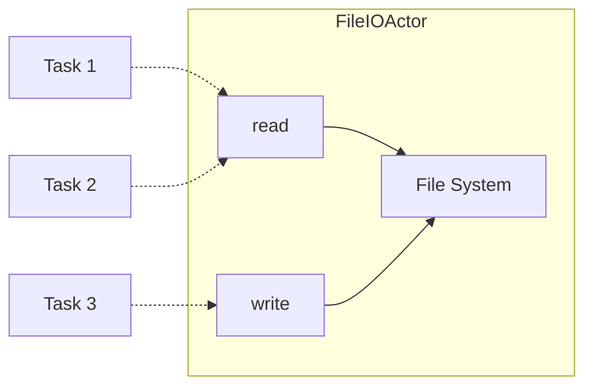
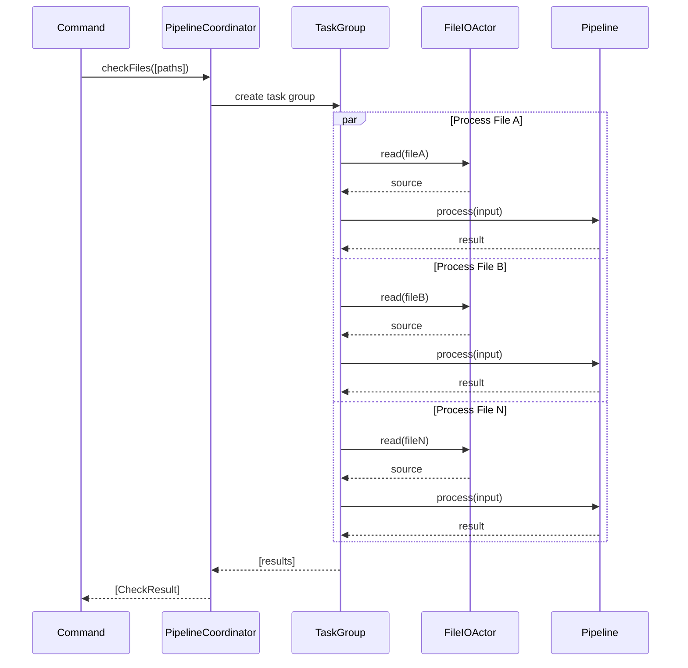
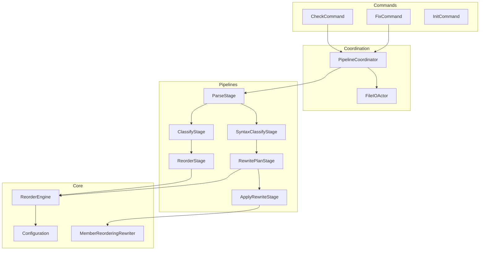
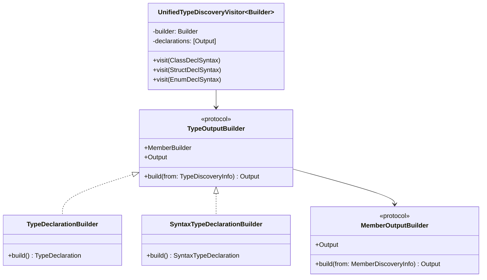

# Swift Structure Architecture

This document describes the architectural design of Swift Structure, an AST-based CLI tool that organizes the internal structure of Swift types.

## Table of Contents

- [Overview](#overview)
- [Design Principles](#design-principles)
- [Architectural Layers](#architectural-layers)
- [Pipeline Pattern](#pipeline-pattern)
- [Data Flow](#data-flow)
- [Domain Model](#domain-model)
- [Concurrency Model](#concurrency-model)
- [Component Relationships](#component-relationships)
- [Visitor Pattern](#visitor-pattern)

## Overview

Swift Structure is built on **SwiftSyntax** to parse and analyze Swift source code. The tool reorders members within type declarations (struct, class, enum, actor, protocol) according to configurable ordering rules, without modifying any code and preserving all trivia (comments, whitespace).

### Architectural Constraints

The architecture enforces several invariants that guide all design decisions:

| Constraint | Description |
|------------|-------------|
| **No code modification** | Only member order changes; syntax remains untouched |
| **Trivia preservation** | Comments and whitespace move with their associated members |
| **Deterministic output** | Same input always produces identical output |
| **Boundary respect** | Members never cross extension or file boundaries |
| **Validation over inference** | Prefer checking correctness over inferring intent |

## Design Principles

### SOLID Principles

The codebase strictly follows SOLID principles:

| Principle | Application |
|-----------|-------------|
| **Single Responsibility** | Each pipeline stage handles exactly one transformation step |
| **Open/Closed** | New stages can be added without modifying existing ones |
| **Liskov Substitution** | Any Stage can be replaced by another with matching Input/Output types |
| **Interface Segregation** | Stage protocol has a single method requirement |
| **Dependency Inversion** | Commands depend on abstractions (protocols), not concrete implementations |

### Type Safety

The architecture leverages Swift's type system to prevent invalid states at compile time:

- **Generic pipelines** ensure type mismatches are caught during compilation
- **Sendable conformance** guarantees thread-safety verified by the compiler
- **Associated types** enforce Input/Output relationships statically

## Architectural Layers

The system is organized in four distinct layers, each with clear responsibilities:

```text
┌─────────────────────────────────────────────────────────────────┐
│                         Commands                                │
│                                                                 │
│  Entry points for CLI operations. Orchestrate the pipeline      │
│  execution and handle user-facing input/output.                 │
└─────────────────────────────────────────────────────────────────┘
                              │
                              ▼
┌─────────────────────────────────────────────────────────────────┐
│                     PipelineCoordinator                         │
│                                                                 │
│  Manages parallel file processing using structured concurrency. │
│  Coordinates async I/O operations across multiple files.        │
└─────────────────────────────────────────────────────────────────┘
                              │
                              ▼
┌─────────────────────────────────────────────────────────────────┐
│                          Pipeline                               │
│                                                                 │
│  Composable chain of type-safe stages. Each stage performs      │
│  a single transformation step on the data.                      │
└─────────────────────────────────────────────────────────────────┘
                              │
                              ▼
┌─────────────────────────────────────────────────────────────────┐
│                           Core                                  │
│                                                                 │
│  Domain models, AST visitors, configuration handling, and       │
│  the reordering engine. Contains all business logic.            │
└─────────────────────────────────────────────────────────────────┘
```

### Layer Responsibilities

**Commands Layer**
- Parse CLI arguments
- Load configuration
- Invoke PipelineCoordinator
- Format and display results
- Handle exit codes

**PipelineCoordinator Layer**
- Parallel file processing via TaskGroup
- Async file I/O coordination
- Result aggregation
- Error propagation

**Pipeline Layer**
- Stage composition and execution
- Type-safe data transformation
- Sequential processing within a single file

**Core Layer**
- Domain models (types, members, declarations)
- AST traversal via SwiftSyntax visitors
- Configuration parsing and validation
- Reordering algorithm implementation

## Pipeline Pattern

The pipeline pattern is the architectural foundation of Swift Structure. It enables composable, type-safe, and testable data transformations.

### Pattern Structure

```text
┌─────────┐    ┌─────────┐    ┌─────────┐    ┌─────────┐
│ Stage A │───▶│ Stage B │───▶│ Stage C │───▶│ Stage D │
└─────────┘    └─────────┘    └─────────┘    └─────────┘
     │              │              │              │
  Input A       Output A       Output B       Output C
                (Input B)      (Input C)      (Input D)
```

### Key Characteristics

| Characteristic | Benefit |
|----------------|---------|
| **Composability** | Stages can be freely combined using the `.then()` operator |
| **Type Safety** | Output of stage N must match input of stage N+1 (compile-time verified) |
| **Single Responsibility** | Each stage has exactly one job |
| **Testability** | Stages can be tested in isolation with mock inputs |
| **Extensibility** | New stages can be inserted without modifying existing ones |

### Stage Contract

Every stage in the pipeline adheres to a minimal contract:

- Receives a **single input** of a specific type
- Produces a **single output** of a specific type
- Is **stateless** between invocations
- Is **Sendable** for concurrent execution

## Data Flow

Swift Structure uses two distinct pipelines optimized for their specific operations.

### Check Pipeline

Used by the `check` command to analyze files without modification:

```text
┌────────────┐    ┌────────────────┐    ┌────────────────┐
│ ParseStage │───▶│ ClassifyStage  │───▶│ ReorderStage   │
└────────────┘    └────────────────┘    └────────────────┘
       │                  │                     │
   ParseInput        ParseOutput          ClassifyOutput
   (path, source)    (AST tree)           (types, members)
                                                │
                                                ▼
                                          ReorderOutput
                                          (reorder results)
```

| Stage | Responsibility |
|-------|----------------|
| ParseStage | Parse source string into SwiftSyntax AST |
| ClassifyStage | Discover types and their members from AST |
| ReorderStage | Compute ideal member order, identify violations |

### Fix Pipeline

Used by the `fix` command to rewrite source files:

```text
┌────────────┐    ┌─────────────────────┐    ┌──────────────────┐    ┌──────────────────┐
│ ParseStage │───▶│ SyntaxClassifyStage │───▶│ RewritePlanStage │───▶│ ApplyRewriteStage│
└────────────┘    └─────────────────────┘    └──────────────────┘    └──────────────────┘
       │                    │                        │                        │
   ParseInput         ParseOutput            SyntaxClassifyOutput      RewritePlanOutput
                      (AST tree)             (types with syntax refs)  (rewrite plans)
                                                                              │
                                                                              ▼
                                                                        RewriteOutput
                                                                        (modified source)
```

| Stage | Responsibility |
|-------|----------------|
| ParseStage | Parse source string into SwiftSyntax AST |
| SyntaxClassifyStage | Discover types with syntax node references |
| RewritePlanStage | Create rewrite plans with indexed members |
| ApplyRewriteStage | Apply member reordering via SyntaxRewriter |

### Why Two Classification Stages?

The architecture provides two classification stages following the Interface Segregation Principle:

- **ClassifyStage**: Produces lightweight models (name, kind, line). Sufficient for check operations that only need to report violations.

- **SyntaxClassifyStage**: Produces models with syntax node references. Required for fix operations that need to manipulate the AST.

This separation avoids burdening check operations with unnecessary syntax node tracking.

## Domain Model

The domain model represents Swift type structures at two levels of abstraction.

### Conceptual Model

```text
                    ┌──────────────────┐
                    │  TypeDeclaration │
                    ├──────────────────┤
                    │ name             │
                    │ kind             │
                    │ line             │
                    └────────┬─────────┘
                             │ contains
                             ▼
                    ┌──────────────────┐
                    │MemberDeclaration │
                    ├──────────────────┤
                    │ name             │
                    │ kind             │
                    │ line             │
                    │ visibility       │
                    │ isAnnotated      │
                    └──────────────────┘
```

### Syntax-Aware Model

For rewriting operations, the model extends to include syntax references:

```text
                    ┌───────────────────────┐
                    │ SyntaxTypeDeclaration │
                    ├───────────────────────┤
                    │ name                  │
                    │ kind                  │
                    │ line                  │
                    │ memberBlock ──────────┼───▶ MemberBlockSyntax
                    └───────────┬───────────┘
                                │ contains
                                ▼
                    ┌───────────────────────┐
                    │SyntaxMemberDeclaration│
                    ├───────────────────────┤
                    │ declaration ──────────┼───▶ MemberDeclaration
                    │ syntax ───────────────┼───▶ MemberBlockItemSyntax
                    └───────────────────────┘
```

### Type Kinds

The system supports all Swift type declarations:

| Kind | Description |
|------|-------------|
| struct | Value type with memberwise initializer |
| class | Reference type with inheritance |
| enum | Sum type with cases |
| actor | Reference type with isolation |
| protocol | Abstract interface definition |

### Member Kinds

Members are classified by their role within a type:

| Kind | Description |
|------|-------------|
| typealias | Type alias declaration |
| associatedtype | Protocol associated type |
| subtype | Nested type declaration |
| staticProperty | Type-level stored/computed property |
| staticMethod | Type-level function |
| instanceProperty | Instance stored/computed property |
| initializer | init declaration |
| deinitializer | deinit declaration |
| instanceMethod | Instance function |
| subscript | Subscript declaration |
| case | Enum case |

## Concurrency Model

Swift Structure uses Swift 6 strict concurrency for safe parallel processing.

### Actor-Based I/O

File operations are encapsulated in an actor to ensure thread-safe access:



The actor serializes all file operations, preventing race conditions.

### Parallel File Processing

The PipelineCoordinator uses structured concurrency to process files in parallel:



### Sendable Guarantee

All models, stages, and pipeline outputs conform to `Sendable`, ensuring:

- Data can be safely passed between concurrent tasks
- No shared mutable state exists
- Thread-safety is verified at compile time

## Component Relationships

The following diagram shows the relationships between major components:



## Visitor Pattern

The AST traversal uses a unified visitor pattern with pluggable builders:



This design enables code reuse: the same visitor logic produces different output types based on the builder provided.
