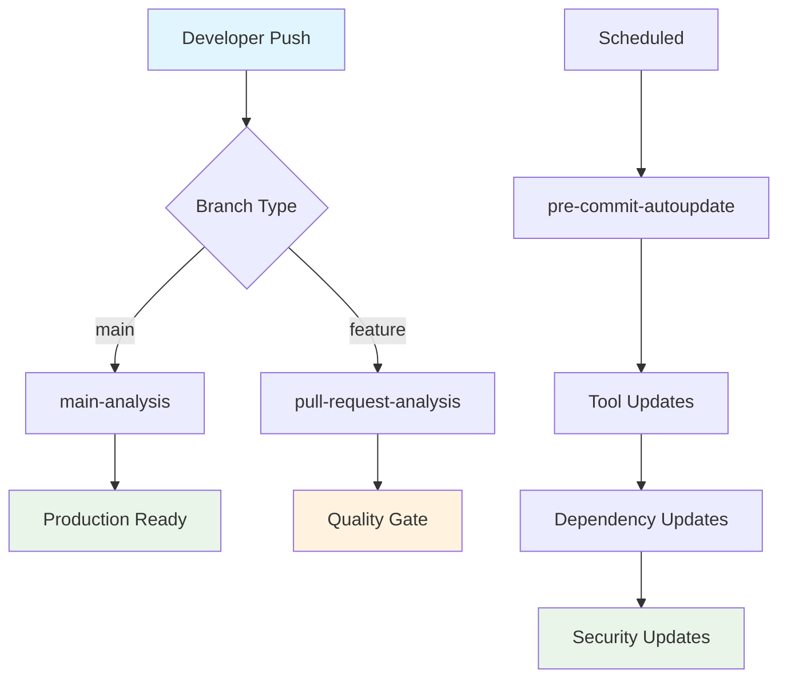
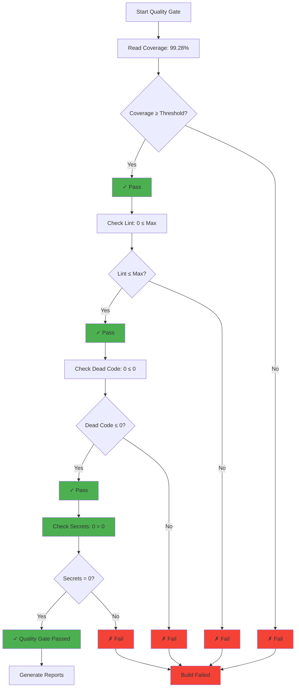
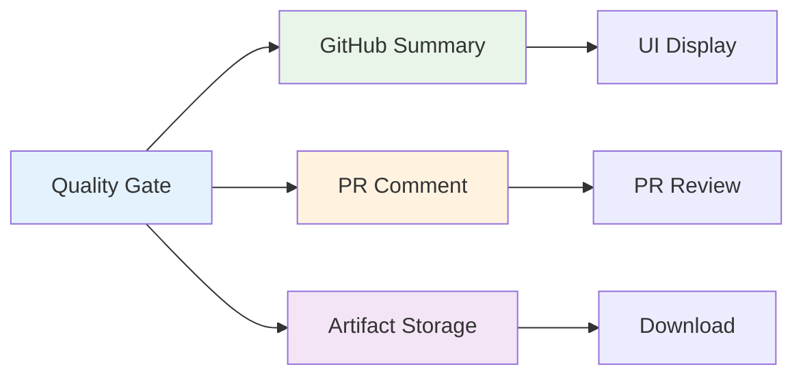
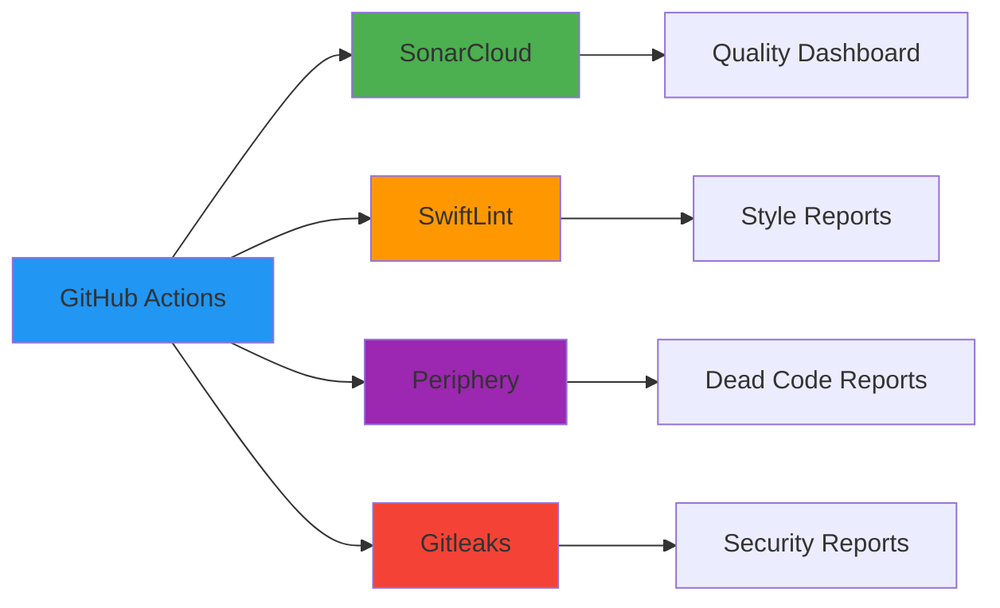
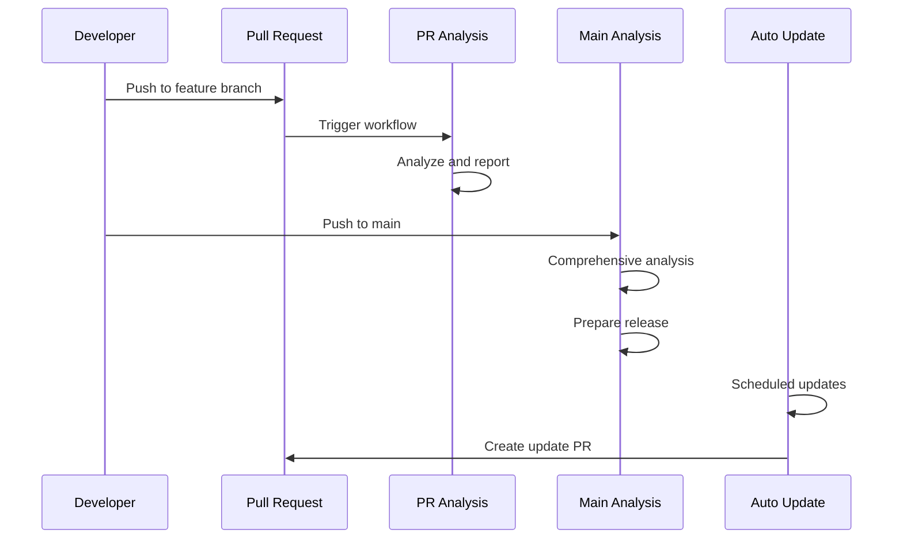

# CI/CD Documentation

## Overview

This document describes the continuous integration and deployment processes implemented in the SwiftStructure project using GitHub Actions.

## Workflows

### 1. Pull Request Analysis (`pull-request-analysis.yml`)

The main workflow that runs on every pull request to ensure code quality, security, and test coverage.

**Documentation:** [pull-request-analysis.md](pull-request-analysis.md)

**Purpose:**
- **Code Quality**: Run static analysis tools (SwiftLint, Periphery)
- **Security**: Scan for secrets (Gitleaks)
- **Testing**: Run test suite with coverage reporting
- **Quality Gates**: Enforce quality thresholds
- **Reporting**: Generate comprehensive quality reports

**Key Metrics:**
- **Coverage**: 99.28% (Regions) - Target: ≥95%
- **Lint Violations**: 0 - Target: ≤10
- **Dead Code**: 0 - Target: 0
- **Security Issues**: 0 - Target: 0

### 2. Main Analysis (`main-analysis.yml`)

Comprehensive workflow that runs on pushes to the main branch for production readiness.

**Documentation:** [main-analysis.md](main-analysis.md)

**Purpose:**
- **Production Readiness**: Ensure main branch is always releasable
- **Comprehensive Analysis**: Complete codebase analysis
- **Trend Analysis**: Track quality metrics over time
- **Release Preparation**: Generate release artifacts

**Key Metrics:**
- **Coverage**: 99.28% (Regions) - Target: ≥98%
- **Security**: 0 issues - Target: 0
- **Code Quality**: ≤5 violations - Target: ≤5
- **Documentation**: 85% coverage - Target: ≥80%

### 3. Pre-commit Autoupdate (`pre-commit-autoupdate.yml`)

Automated workflow for maintaining development tools and dependencies.

**Documentation:** [pre-commit-autoupdate.md](pre-commit-autoupdate.md)

**Purpose:**
- **Tool Maintenance**: Automatically update development tools
- **Dependency Management**: Keep dependencies current and secure
- **Security Updates**: Apply security patches automatically
- **Developer Experience**: Ensure smooth development workflow

**Schedule:**
- **Automatic**: Every Monday at 9:00 AM UTC
- **Manual**: On-demand with specific options

## Workflow Architecture

### Overall Flow



### Job Dependencies

```mermaid
graph TD
    A[Pull Request Analysis] --> B[build-and-test]
    A --> C[static-analysis]
    A --> D[quality-gate]
    A --> E[pr-comment]
    
    F[Main Analysis] --> G[full-build]
    F --> H[comprehensive-analysis]
    F --> I[security-scan]
    F --> J[quality-report]
    F --> K[release-prep]
    F --> L[trend-analysis]
    
    M[Pre-commit Autoupdate] --> N[check-updates]
    M --> O[update-tools]
    M --> P[update-dependencies]
    M --> Q[security-scan]
    M --> R[create-pr]
    
    style A fill:#e3f2fd
    style F fill:#4caf50
    style M fill:#ff9800
```



## Quality Metrics

### Coverage Types

| Type | Description | PR Target | Main Target | Current |
|------|-------------|-----------|------------|---------|
| **Regions Coverage** | Blocks of executable code | ≥95% | ≥98% | 99.28% |
| **Lines Coverage** | Lines of code executed | ≥95% | ≥95% | 100.00% |
| **Functions Coverage** | Functions called | ≥95% | ≥95% | 100.00% |

### Static Analysis Metrics

| Tool | Purpose | PR Threshold | Main Threshold | Current |
|------|---------|--------------|----------------|---------|
| **SwiftLint** | Code style and conventions | ≤10 violations | ≤5 violations | 0 |
| **Periphery** | Dead code detection | ≤0 findings | ≤0 findings | 0 |
| **Gitleaks** | Secret detection | 0 findings | 0 findings | 0 |

### Quality Gate Logic



## Artifacts and Reports

### Generated Artifacts

| Artifact | Content | Purpose | Consumers |
|----------|---------|---------|-----------|
| **coverage/lcov.info** | LCOV format coverage data | SonarQube integration | Quality Gate |
| **coverage/regions-percent.txt** | Regions coverage percentage | Quality gate calculation | Quality Gate |
| **reports/swiftlint.json** | SwiftLint findings | Style analysis | Quality Gate |
| **reports/periphery.json** | Dead code findings | Code cleanup | Quality Gate |
| **reports/gitleaks.sarif** | Security findings | Security audit | Quality Gate |

### Report Distribution



## Configuration

### Environment Variables

| Variable | Description | Default | PR | Main |
|----------|-------------|---------|----|------|
| `COVERAGE_THRESHOLD` | Minimum coverage percentage | 95 | 95 | 98 |
| `MAX_LINT_VIOLATIONS` | Maximum allowed lint violations | 10 | 10 | 5 |
| `MAX_DEAD_CODE` | Maximum allowed dead code findings | 0 | 0 | 0 |
| `FAIL_ON_SECRETS` | Fail build on secrets found | true | true | true |
| `STRICT_MODE` | Enable strict quality enforcement | false | false | false |

### Repository Variables

Configure these in GitHub repository Settings → Secrets and variables → Actions:

```yaml
# Repository Variables
COVERAGE_THRESHOLD: 95
MAX_LINT_VIOLATIONS: 10
MAX_DEAD_CODE: 0
FAIL_ON_SECRETS: true
STRICT_MODE: false

# Required Secrets
SONAR_TOKEN: # For SonarCloud analysis
GITHUB_TOKEN: # Built-in, no setup needed
```

## Performance Metrics

### Execution Time

| Workflow | Average Time | Optimization |
|----------|---------------|-------------|
| **Pull Request Analysis** | 8-14 minutes | Parallel execution |
| **Main Analysis** | 30-47 minutes | Comprehensive analysis |
| **Pre-commit Autoupdate** | 13-22 minutes | Efficient updates |

### Resource Usage

**Runner Requirements:**
- **Pull Request**: `macos-26`, 7GB RAM, 30 min timeout
- **Main Analysis**: `macos-26`, 16GB RAM, 60 min timeout
- **Pre-commit**: `ubuntu-latest`, 4GB RAM, 30 min timeout

## Integration Points

### External Services



### Data Flow



## Troubleshooting

### Common Issues

#### Coverage Issues
- **Empty Coverage**: Check `regions-percent.txt` generation
- **100% vs 99.28%**: Ensure using Regions Coverage (column 4)
- **File Not Found**: Verify artifact upload/download

#### Quality Gate Failures
- **Threshold Issues**: Check repository variables
- **Tool Failures**: Verify tool installations
- **Report Parsing**: Check JSON format validity

#### Performance Issues
- **Slow Builds**: Check cache effectiveness
- **Timeout Issues**: Increase timeout values
- **Resource Limits**: Monitor runner usage

### Debug Mode

Enable debug output by checking workflow logs for:
```
🔍 DEBUG: Regions Coverage from file = 99.28%
🔍 DEBUG: LINT_COUNT=0, DEAD_CODE_COUNT=0, SECRETS_COUNT=0
🔍 DEBUG: FAIL=0
```

## Best Practices

### Workflow Optimization

1. **Use Artifacts**: Share data efficiently between jobs
2. **Cache Dependencies**: Speed up build times
3. **Parallel Execution**: Run independent jobs simultaneously
4. **Graceful Failures**: Continue analysis despite individual tool failures

### Quality Standards

1. **High Coverage**: Target 99.28% regions coverage
2. **Zero Tolerance**: No secrets or critical issues
3. **Clean Code**: Minimize lint violations and dead code
4. **Fast Feedback**: Provide quick, actionable feedback

### Maintenance

1. **Regular Updates**: Keep tools and actions current
2. **Threshold Review**: Adjust quality targets as needed
3. **Performance Monitoring**: Track execution times and success rates
4. **Documentation**: Keep configuration and processes documented

## Documentation Structure

```
Docs/CI/
├── README.md                    # This file - Overview
├── pull-request-analysis.md    # PR workflow details
├── main-analysis.md             # Main branch workflow details
└── pre-commit-autoupdate.md     # Auto-update workflow details
```

## Future Enhancements

### Planned Improvements

1. **Performance**: Parallel test execution, incremental builds
2. **Monitoring**: Quality metrics dashboard, trend analysis
3. **Automation**: Auto-merge for passing quality gates
4. **Integration**: Slack/Teams notifications, dashboard integration

### Scaling Considerations

- **Large Repositories**: Incremental analysis, smart caching
- **Multiple Environments**: Staging/production workflows
- **Cross-Platform**: Linux/Windows runner support
- **Container Support**: Docker-based build environments

## Quick Start

### For New Team Members

1. **Understand Workflows**: Review workflow documentation
2. **Check Quality Standards**: Review current metrics and thresholds
3. **Review Real Workflows**: Check `.github/workflows/` directory

### For Maintainers

1. **Monitor Performance**: Track execution times and success rates
2. **Update Configurations**: Adjust thresholds and rules as needed
3. **Review Real Code**: Check actual workflow implementations

### For Contributors

1. **Understand Quality Gates**: Know what blocks merges
2. **Review Reports**: Understand feedback from automated analysis
3. **Follow Standards**: Adhere to coding and quality standards

This documentation provides a comprehensive guide to the CI/CD processes in the SwiftStructure project.
