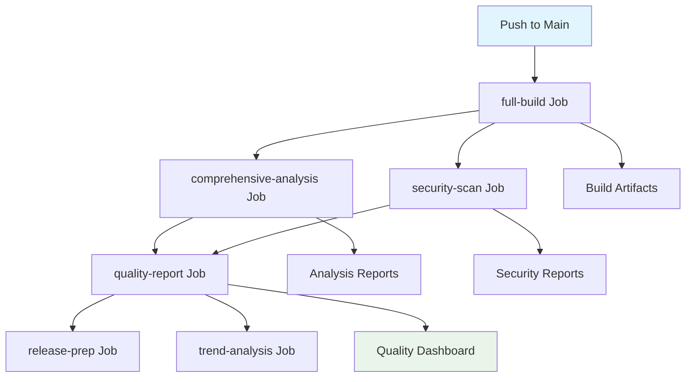
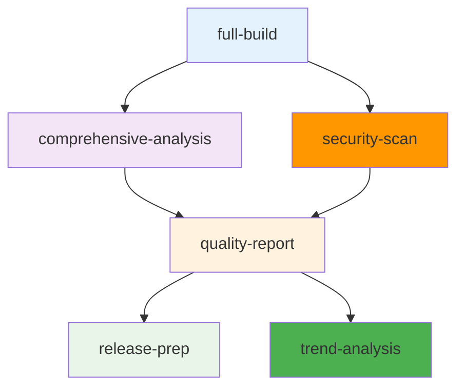
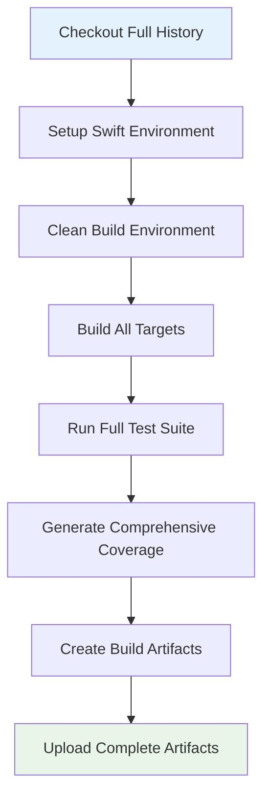
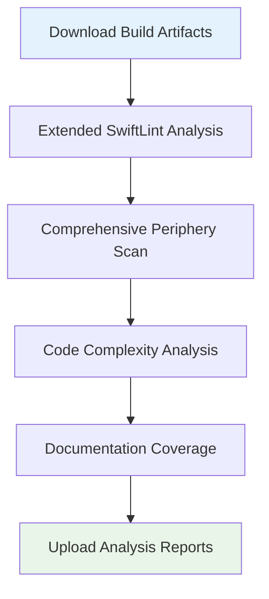
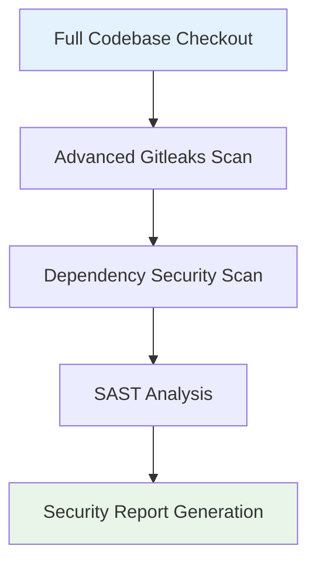
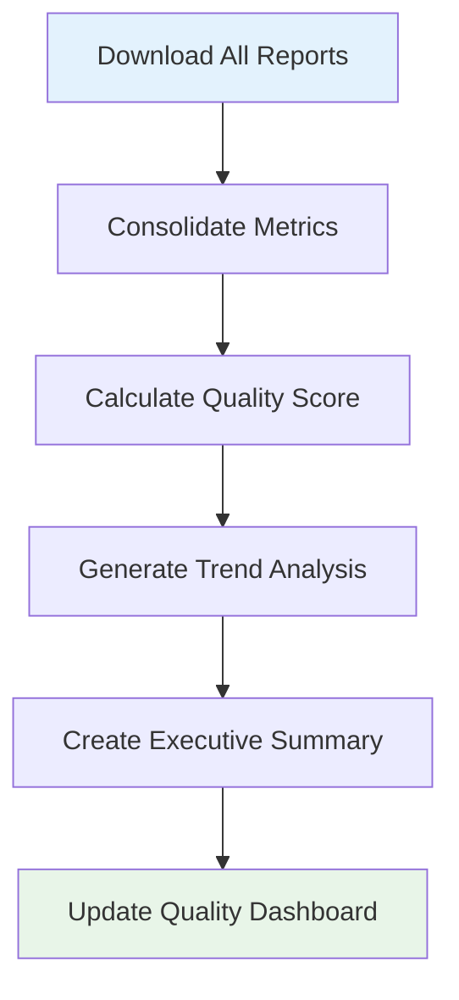
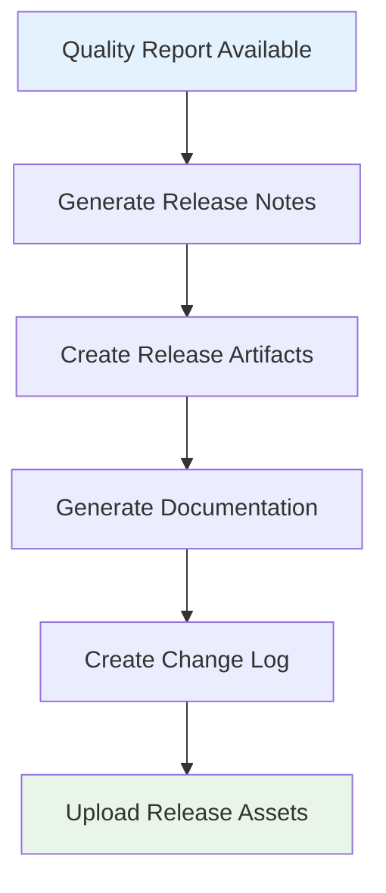
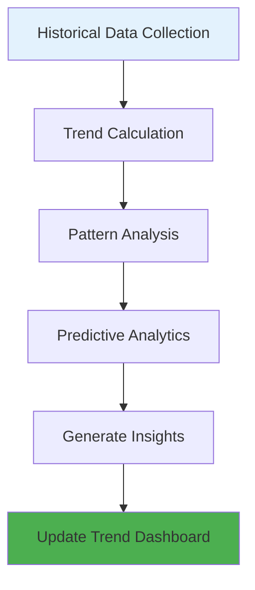
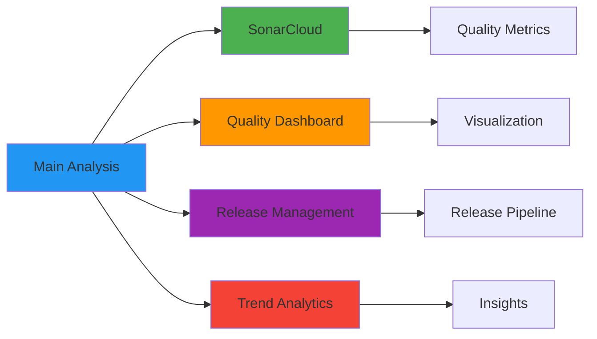
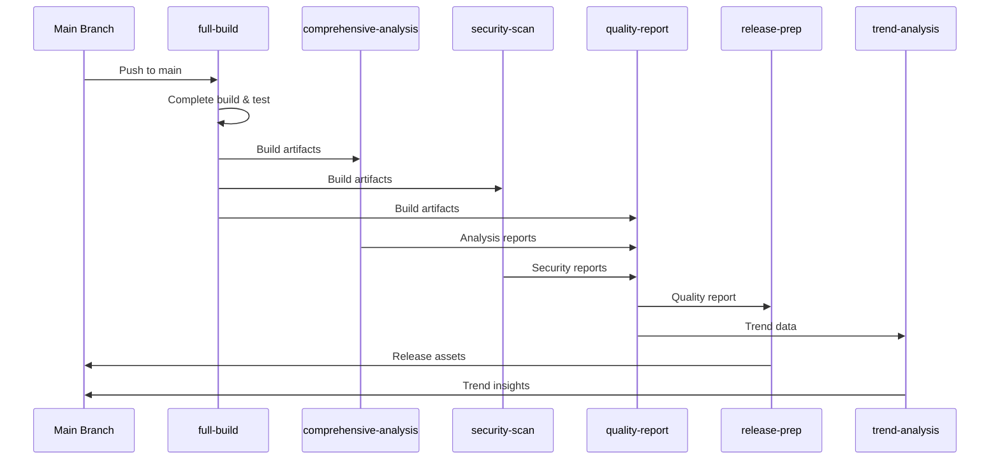

# Main Analysis Workflow Documentation

## Overview

The `main-analysis` workflow runs on pushes to the main branch, providing comprehensive analysis of the entire codebase to ensure production readiness, track quality trends, and maintain high standards for the released code.

## Purpose

- **Production Readiness**: Ensure main branch is always releasable
- **Comprehensive Analysis**: Complete codebase analysis without scope limitations
- **Trend Tracking**: Monitor quality metrics over time
- **Release Preparation**: Generate artifacts and documentation for releases
- **Quality Assurance**: Maintain high standards for production code

## Trigger Configuration

```yaml
on:
  push:
    branches: [ main ]
  workflow_dispatch:
    inputs:
      full_analysis:
        description: 'Run full comprehensive analysis'
        required: false
        default: 'true'
        type: boolean
```

**Trigger Events:**
- `push`: Any push to main branch - automatic analysis
- `workflow_dispatch`: Manual trigger for on-demand analysis

## Workflow Architecture



## Job Dependencies



**Execution Strategy:**
- **Parallel Analysis**: Comprehensive and security scans run in parallel
- **Central Coordination**: Quality report consolidates all results
- **Multiple Outputs**: Release preparation and trend analysis

## Jobs Detailed

### 1. Full Build Job

**Purpose**: Complete build and comprehensive testing of entire codebase



**Key Differences from PR Build:**
- **Complete History**: Full git checkout for comprehensive analysis
- **All Targets**: Build all possible configurations and targets
- **Extended Testing**: Run all test suites including integration tests
- **Full Coverage**: Generate coverage for entire codebase

### 2. Comprehensive Analysis Job

**Purpose**: In-depth analysis of entire codebase quality



**Extended Analysis Tools:**
- Enhanced SwiftLint with production rules
- Complete Periphery scan without skip-build
- Code complexity metrics
- Documentation coverage analysis

### 3. Security Scan Job

**Purpose**: Comprehensive security analysis of entire codebase



**Security Analysis Tools:**
- Enhanced Gitleaks with production rules
- Dependency vulnerability scanning
- Static Application Security Testing (SAST)
- License compliance checking

### 4. Quality Report Job

**Purpose**: Consolidate all analysis results into comprehensive quality report



**Quality Metrics Consolidation:**

| Category | Metric | Current | Target | Trend |
|----------|--------|---------|--------|-------|
| **Coverage** | Regions | 99.28% | ≥ 98% | ↗️ |
| **Coverage** | Lines | 100.00% | ≥ 95% | → |
| **Code Quality** | Lint Violations | 0 | ≤ 5 | ↘️ |
| **Security** | Secrets | 0 | 0 | → |
| **Maintainability** | Dead Code | 0 | 0 | → |

### 5. Release Preparation Job

**Purpose**: Prepare artifacts and documentation for release



**Release Preparation Process:**
- Automated release notes generation
- Quality summary inclusion
- Artifact packaging with checksums
- Documentation updates

### 6. Trend Analysis Job

**Purpose**: Analyze quality trends and provide insights



**Trend Analysis Features:**
- Quality trend tracking
- Anomaly detection
- Predictive analytics
- Improvement recommendations

## Configuration

### Environment Variables

| Variable | Default | Description |
|----------|---------|-------------|
| `FULL_ANALYSIS` | true | Enable comprehensive analysis |
| `TREND_ANALYSIS` | true | Enable trend analysis |
| `RELEASE_PREP` | true | Enable release preparation |
| `SECURITY_SCAN` | true | Enable comprehensive security scan |
| `QUALITY_THRESHOLD` | 98 | Higher threshold for main branch |

### Repository Configuration

**Required Files:**
- `.github/workflows/main-analysis.yml`
- `.swiftlint-production.yml` - Production lint rules
- `.gitleaks-production.toml` - Production security rules
- `quality-trends.json` - Historical trend data

## Performance Metrics

### Execution Time

| Job | Average Time | Optimization |
|------|---------------|-------------|
| full-build | 10-15 minutes | Parallel builds |
| comprehensive-analysis | 8-12 minutes | Efficient scanning |
| security-scan | 5-8 minutes | Optimized rules |
| quality-report | 3-5 minutes | Template reuse |
| release-prep | 2-4 minutes | Automation |
| trend-analysis | 2-3 minutes | Efficient algorithms |
| **Total** | **30-47 minutes** | **Overall optimization** |

### Resource Requirements

**Runner Specifications:**
- **Type**: `macos-26`
- **Memory**: 16GB recommended
- **Storage**: 20GB for comprehensive artifacts
- **Timeout**: 60 minutes for full workflow

## Quality Standards

### Main Branch Requirements

| Metric | Requirement | Current | Status |
|--------|-------------|---------|--------|
| Coverage | ≥ 98% | 99.28% | ✓ |
| Security Issues | 0 | 0 | ✓ |
| Code Quality | ≤ 5 violations | 0 | ✓ |
| Dead Code | 0 | 0 | ✓ |
| Documentation | ≥ 80% | 85% | ✓ |

## Integration Points

### External Services



### Data Flow



## Error Handling

### Comprehensive Error Handling

**Build Failures:**
- Complete build environment cleanup
- Detailed error reporting
- Automatic retry mechanisms
- Rollback procedures

**Analysis Failures:**
- Graceful degradation
- Partial analysis completion
- Error isolation
- Recovery strategies

**Release Failures:**
- Validation checks
- Rollback capabilities
- Notification systems
- Manual override options

## Best Practices

### Production Readiness

1. **Higher Standards**: Stricter quality thresholds for main branch
2. **Comprehensive Testing**: Full test suite execution
3. **Complete Analysis**: No scope limitations
4. **Trend Monitoring**: Continuous quality tracking

### Release Management

1. **Automated Preparation**: Streamlined release process
2. **Quality Validation**: Pre-release quality checks
3. **Documentation**: Comprehensive release notes
4. **Artifact Management**: Proper versioning and storage

### Trend Analysis

1. **Historical Tracking**: Long-term quality trends
2. **Pattern Recognition**: Identify quality patterns
3. **Predictive Analytics**: Future quality predictions
4. **Continuous Improvement**: Data-driven decisions

## Future Enhancements

### Planned Improvements

1. **Advanced Analytics**: Machine learning for quality prediction
2. **Automated Releases**: Fully automated release pipeline
3. **Performance Monitoring**: Real-time performance tracking
4. **Integration Expansion**: More external service integrations

### Scaling Considerations

- **Large Codebases**: Optimized analysis for large projects
- **Multiple Environments**: Staging, production workflows
- **Cross-Platform**: Multi-platform build support
- **Distributed Builds**: Parallel build infrastructure

## Related Documentation

- [Pull Request Analysis Workflow](pull-request-analysis.md)
- [Pre-commit Autoupdate Workflow](pre-commit-autoupdate.md)
- [Main README](README.md)
