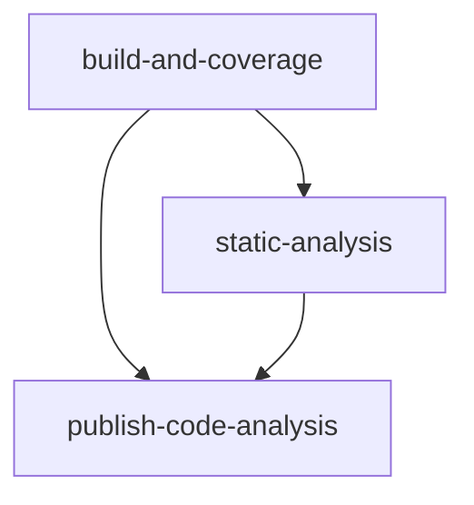

# Main Analysis Workflow Documentation

## Overview

The `main-analysis` workflow runs on pushes to the `main` and `ci-optimization` branches, executing a **fast, deterministic, and SwiftPM-aligned analysis pipeline**. The workflow prioritizes execution speed and stability by treating `swift test` as the canonical build step and reusing the generated `.build` artifacts for static analysis (Periphery), linting, security scanning, and quality reporting.

This design avoids redundant builds, minimizes SwiftPM rebuild overhead, and reflects the practical limits of SwiftPM’s build graph, resulting in a balanced trade-off between performance, accuracy, and maintainability.

## Key Principles

- **SwiftPM-native architecture**: `swift test` is the canonical build step.
- **No redundant builds**: `swift build` is intentionally omitted to avoid duplicate compilation.
- **Artifact reuse**: `.build` is persisted and reused across jobs.
- **Fast CI**: Optimized for minimal wall-clock time without hacks or unsupported flags.
- **Deterministic analysis**: Static analysis tools operate on the same build graph generated by tests.

## Purpose

- **Production Readiness**: Ensure the main branch is always releasable.
- **Fast Feedback Loop**: Minimize CI latency while preserving correctness.
- **Comprehensive Analysis**: Run linting, dead-code detection, security scanning, and coverage generation.
- **Artifact Reuse**: Share build outputs across jobs to avoid recomputation.
- **Operational Simplicity**: Prefer stable SwiftPM behavior over experimental optimizations.

## Trigger Configuration

```yaml
on:
  push:
    branches: [ main ]
```

**Trigger Events:**
- `push`: Automatic analysis on pushes to `main` and `ci-optimization`.

## Workflow Architecture

```mermaid
flowchart TD
    A[Push to Branch] --> B[build-and-coverage Job]
    B --> C[static-analysis Job]
    B --> D[publish-code-analysis Job]

    B --> E[Build Artifacts (.build)]
    B --> F[Coverage Reports]
    C --> G[Static Analysis Reports]
    D --> H[Sonar Publication]
```

## Job Dependencies



**Execution Strategy:**
- **Canonical Build via Tests**: `swift test` performs the only real build.
- **Artifact Propagation**: `.build` and coverage data are shared across jobs.
- **Static Analysis Reuse**: Periphery runs with `--skip-build` using existing artifacts.

## Jobs Detailed

### 1. Build and Coverage Job

**Purpose**: Execute tests, generate coverage, and produce the canonical build artifacts.

**Key Steps:**
- Setup Swift toolchain.
- Restore SwiftPM cache (`.build`).
- Run tests with coverage:

```bash
swift test --enable-code-coverage --quiet
```

- Generate LCOV and Sonar-compatible coverage reports.
- Upload:
  - `coverage/` artifacts
  - `.build` artifacts for reuse in subsequent jobs

**Rationale:**
- `swift test` already builds the package; running `swift build` separately would duplicate work and slow down CI.
- Coverage instrumentation forces recompilation, so avoiding extra builds is critical for performance.

### 2. Static Analysis Job

**Purpose**: Perform static analysis using the canonical build artifacts.

**Key Tools:**
- SwiftLint (code style and linting)
- Periphery (dead-code detection)
- Gitleaks (secret scanning)

**Periphery Execution:**

```bash
periphery scan \
  --skip-build \
  --build-path .build
```

**Rationale:**
- Periphery analyzes the same build graph produced by `swift test`, ensuring consistency.
- `--skip-build` avoids unnecessary recompilation and keeps CI fast.

### 3. Publish Code Analysis Job

**Purpose**: Publish coverage and static analysis results to Sonar.

**Key Steps:**
- Download coverage and analysis artifacts.
- Run Sonar Scanner using stored reports.

## Performance Characteristics

### Design Trade-offs

| Dimension | Decision | Rationale |
|----------|---------|----------|
| Build Strategy | `swift test` as canonical build | Fastest stable approach in SwiftPM |
| Separate `swift build` | Omitted | Avoids duplicate compilation |
| Release Build | Not used | Debug builds are faster and better suited for coverage |
| Artifact Reuse | Enabled | Minimizes recomputation |
| Static Analysis Build | Skipped | Uses existing `.build` artifacts |

### Expected Performance

| Pipeline Variant | Relative Speed |
|-----------------|---------------|
| Debug test-only build | Fastest (baseline) |
| Debug + Periphery reuse | ~60–75% of naive build time |
| Debug + separate `swift build` | Slower (redundant) |
| Release + test builds | Slowest |

## Resource Requirements

**Runner Specifications:**
- **Type**: `macos-26`
- **Memory**: 16GB recommended
- **Timeout**: 30 minutes

## Best Practices

1. **Avoid redundant builds**: Do not add `swift build` unless strictly required.
2. **Prefer debug builds**: Faster and more reliable for coverage.
3. **Reuse artifacts**: Always share `.build` between jobs.
4. **Keep SwiftPM semantics**: Avoid unsupported flags like `--skip-build` with `swift test`.
5. **Optimize for stability first**: Favor predictable behavior over theoretical optimizations.

## Future Improvements (Realistic)

- Parallelization of independent analysis tasks.
- Incremental SwiftLint execution.
- Selective Periphery scopes for large codebases.
- Build-time telemetry and regression detection.

## Related Documentation

- Pull Request Analysis Workflow
- Pre-commit Autoupdate Workflow
- Main README
