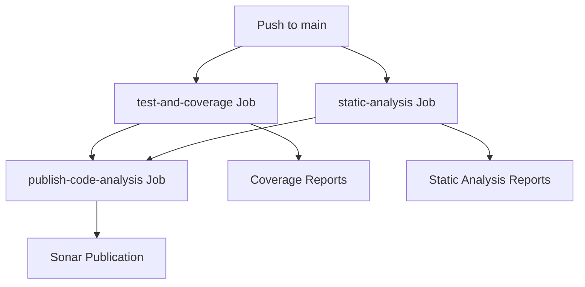

# Main Analysis Workflow Documentation

## Overview

The `main-analysis` workflow runs on pushes to the `main` branch, executing a **streamlined and independent analysis pipeline**. The workflow prioritizes simplicity and reliability by allowing each job to manage its own build process, eliminating complex artifact sharing and ensuring consistent execution.

This design removes redundant build artifact management, minimizes inter-job dependencies, and provides a clean separation of concerns between testing, static analysis, and reporting phases.

## Key Principles

- **Job Independence**: Each job manages its own build process.
- **No Artifact Sharing**: Eliminates complex upload/download of build artifacts.
- **Simplified Architecture**: Clean separation between testing, analysis, and publishing.
- **Reliable Execution**: Each job can run independently without complex dependencies.
- **Minimal Complexity**: Straightforward workflow that's easy to debug and maintain.

## Purpose

- **Production Readiness**: Ensure the main branch is always releasable.
- **Fast Feedback Loop**: Parallel execution of independent jobs.
- **Comprehensive Analysis**: Run linting, dead-code detection, security scanning, and coverage generation.
- **Operational Simplicity**: Each job handles its own setup and execution.
- **Maintainability**: Clean workflow structure that's easy to understand and modify.

## Trigger Configuration

```yaml
on:
  push:
    branches: [ main ]
```

**Trigger Events:**
- `push`: Automatic analysis on pushes to `main` only.

## Workflow Architecture



## Job Dependencies


**Execution Strategy:**
- **Independent Jobs**: `test-and-coverage` and `static-analysis` run in parallel.
- **Simple Dependencies**: Only `publish-code-analysis` depends on both jobs.
- **No Build Sharing**: Each job creates its own build as needed.

## Jobs Detailed

### 1. Test and Coverage Job

**Purpose**: Execute tests and generate coverage reports.

**Key Steps:**
- Setup Swift toolchain.
- Restore SwiftPM cache (`.build`).
- Run tests with coverage:

```bash
swift test --enable-code-coverage --quiet
```

- Generate LCOV and Sonar-compatible coverage reports.
- Upload `coverage/` artifacts for publishing.

**Rationale:**
- Tests provide the primary validation of code functionality.
- Coverage generation is integrated with test execution.
- No need to share build artifacts with other jobs.

### 2. Static Analysis Job

**Purpose**: Perform static analysis with independent build process.

**Key Tools:**
- SwiftLint (code style and linting)
- Periphery (dead-code detection)
- Gitleaks (secret scanning)

**Periphery Execution:**

```bash
periphery scan --format json
```

**Rationale:**
- Each tool manages its own build process for maximum reliability.
- No dependency on external build artifacts.
- Simplified debugging and execution.

### 3. Publish Code Analysis Job

**Purpose**: Publish coverage and static analysis results to Sonar.

**Key Steps:**
- Download coverage and analysis artifacts.
- Run Sonar Scanner using stored reports.

## Performance Characteristics

### Design Trade-offs

| Dimension | Decision | Rationale |
|----------|---------|----------|
| Build Strategy | Independent builds per job | Maximum reliability and simplicity |
| Artifact Sharing | Disabled | Eliminates complexity and potential failures |
| Job Dependencies | Minimal | Enables parallel execution |
| Build Management | Self-contained | Each job controls its own build process |
| Error Isolation | Per-job | Failures don't cascade between jobs |

### Expected Performance

| Pipeline Variant | Relative Speed |
|-----------------|---------------|
| Independent jobs (current) | Fastest (parallel execution) |
| Shared artifacts | Slower (sequential dependencies) |
| Redundant builds | Slowest (duplicate work) |

## Resource Requirements

**Runner Specifications:**
- **Type**: `macos-26`
- **Memory**: 16GB recommended
- **Timeout**: 30 minutes

## Best Practices

1. **Keep jobs independent**: Avoid sharing build artifacts between jobs.
2. **Enable parallel execution**: Structure dependencies to allow concurrent runs.
3. **Simplify artifact management**: Only share final reports, not build artifacts.
4. **Self-contained builds**: Each job should handle its own setup.
5. **Minimize dependencies**: Reduce complex inter-job relationships.

## Future Improvements (Realistic)

- Enhanced caching strategies for independent builds.
- Selective analysis based on changed files.
- Improved test parallelization.
- Advanced reporting and metrics collection.

## Related Documentation

- Pull Request Analysis Workflow
- Pre-commit Autoupdate Workflow
- Main README
