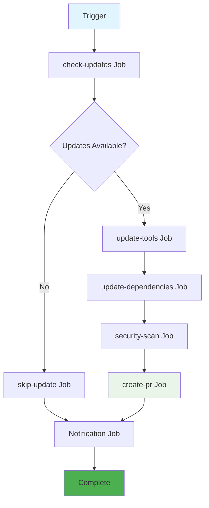
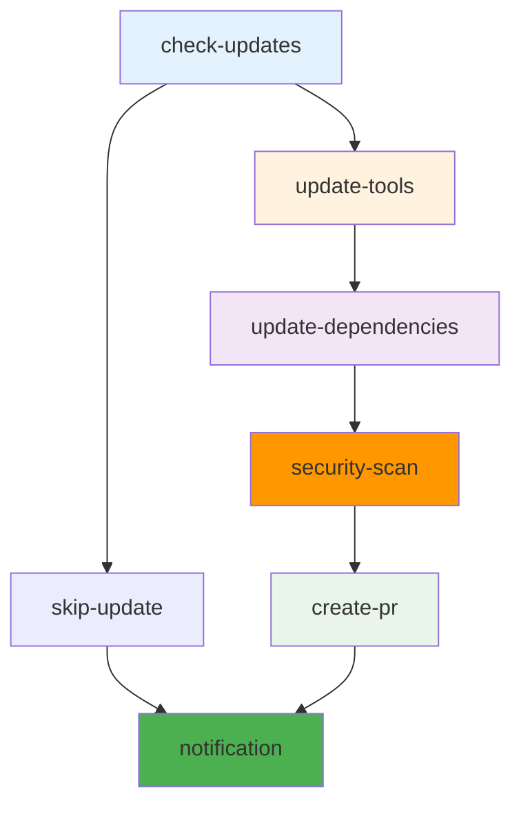
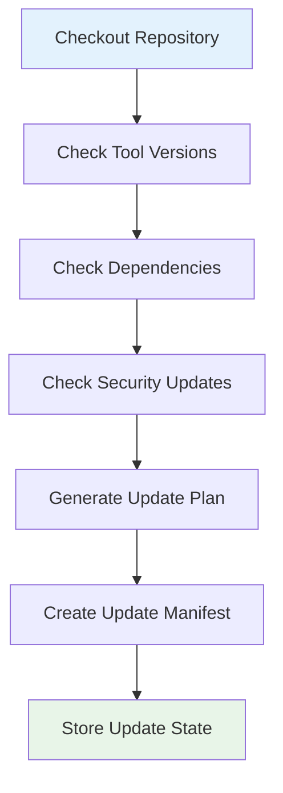
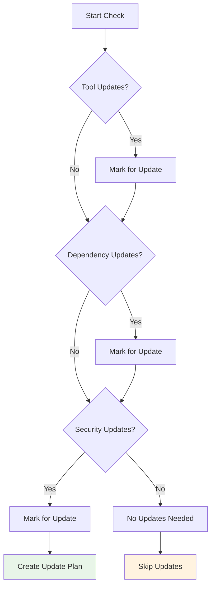
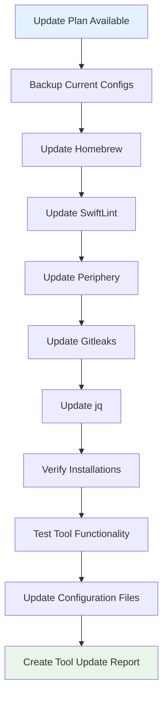
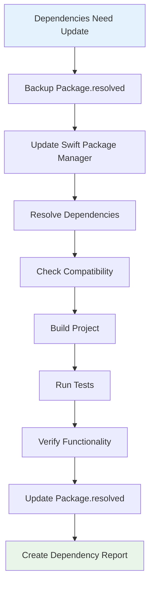
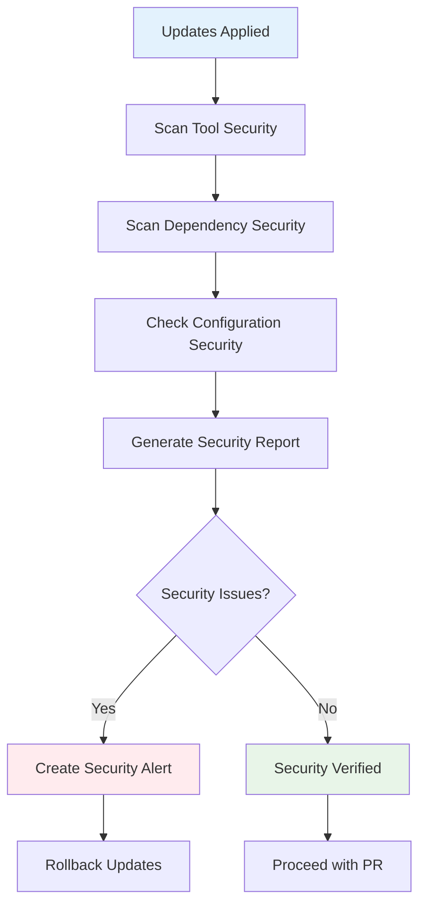
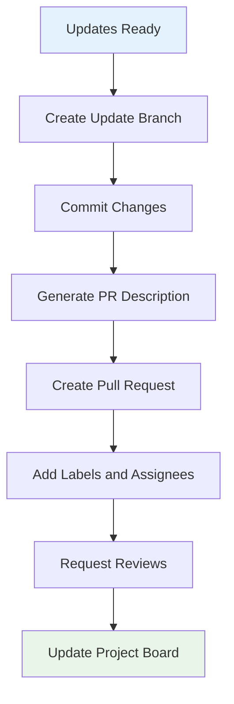
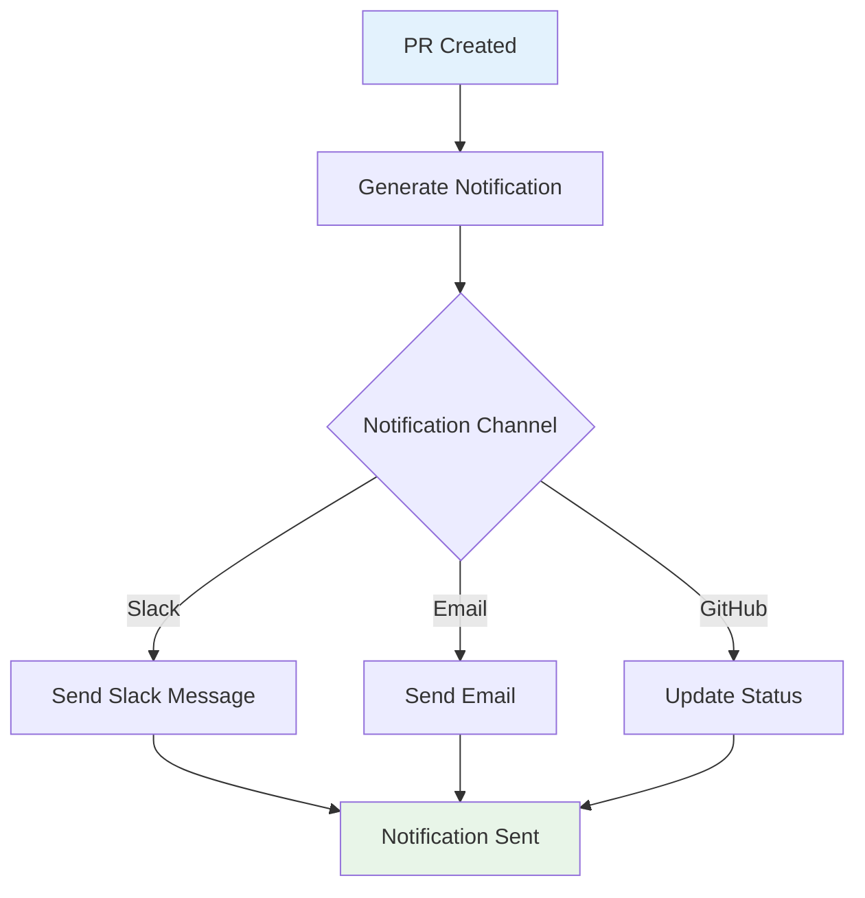

# Pre-commit Autoupdate Workflow Documentation

## Overview

The `pre-commit-autoupdate` workflow automates the maintenance of development tools and dependencies, ensuring that the development environment stays current with the latest versions and security updates.

## Purpose

- **Tool Maintenance**: Automatically update development tools
- **Dependency Management**: Keep dependencies current and secure
- **Security Updates**: Apply security patches automatically
- **Developer Experience**: Ensure smooth development workflow
- **Consistency**: Maintain consistent tool versions across team

## Trigger Configuration

```yaml
on:
  schedule:
    # Run every Monday at 9:00 AM UTC
    - cron: '0 9 * * 1'
  workflow_dispatch:
    inputs:
      update_type:
        description: 'Type of update to perform'
        required: true
        default: 'all'
        type: choice
        options:
          - all
          - tools
          - dependencies
          - security
      force_update:
        description: 'Force update even if no changes detected'
        required: false
        default: false
        type: boolean
```

**Trigger Events:**
- **Schedule**: Every Monday at 9:00 AM UTC - automatic maintenance
- **Manual**: On-demand updates with specific options

## Workflow Architecture



## Job Dependencies



**Execution Flow:**
1. **Check Updates**: Determine what needs updating
2. **Conditional Execution**: Only run updates if needed
3. **Tool Updates**: Update development tools
4. **Dependency Updates**: Update project dependencies
5. **Security Scan**: Verify security of updates
6. **PR Creation**: Create pull request with updates
7. **Notification**: Inform team of updates

## Jobs Detailed

### 1. Check Updates Job

**Purpose**: Determine what tools and dependencies need updates



**Update Detection Process:**

#### Tool Version Check
```bash
# Check current tool versions
echo "=== Current Tool Versions ==="
swiftlint version > current-tools.txt
periphery version >> current-tools.txt
gitleaks version >> current-tools.txt
jq --version >> current-tools.txt

# Check latest available versions
echo "=== Latest Available Versions ==="
brew info swiftlint | grep "swiftlint:" | head -1 > latest-tools.txt
brew info periphery | grep "periphery:" | head -1 >> latest-tools.txt
brew info gitleaks | grep "gitleaks:" | head -1 >> latest-tools.txt

# Compare versions
diff current-tools.txt latest-tools.txt > tool-updates.txt || echo "Tool updates available"
```

#### Dependency Check
```bash
# Check Package.swift dependencies
swift package update
swift package show-dependencies > current-deps.txt

# Check for outdated dependencies
swift package outdated > outdated-deps.txt || echo "Dependencies are current"
```

#### Security Check
```bash
# Check for security vulnerabilities
swift package audit > security-audit.txt || echo "Security issues found"

# Check CVE database
safety check --json > security-cve.txt || echo "CVE scan completed"
```

**Update Decision Logic:**


### 2. Update Tools Job

**Purpose**: Update development tools to latest versions



**Tool Update Process:**

#### Homebrew Update
```bash
# Update Homebrew itself
brew update

# Check for conflicts
brew doctor || echo "Homebrew issues detected"
```

#### Individual Tool Updates
```bash
# Update SwiftLint
brew upgrade swiftlint
swiftlint version > new-swiftlint-version.txt

# Update Periphery
brew upgrade periphery
periphery version > new-periphery-version.txt

# Update Gitleaks
brew upgrade gitleaks
gitleaks version > new-gitleaks-version.txt

# Update jq
brew upgrade jq
jq --version > new-jq-version.txt
```

#### Configuration Updates
```bash
# Update SwiftLint configuration if needed
if [ -f .swiftlint.yml ]; then
  swiftlint generate-config > .swiftlint-new.yml
  # Merge configurations intelligently
fi

# Update Periphery configuration
if [ -f .periphery.yml ]; then
  periphery config --update .periphery.yml
fi

# Update Gitleaks configuration
if [ -f .gitleaks.toml ]; then
  gitleaks config --update .gitleaks.toml
fi
```

#### Verification Process
```bash
# Test tool functionality
swiftlint --version
periphery --version
gitleaks --version
jq --version

# Run basic analysis to verify tools work
swiftlint --quiet || echo "SwiftLint verification failed"
periphery scan --skip-build || echo "Periphery verification failed"
gitleaks detect --help || echo "Gitleaks verification failed"
```

### 3. Update Dependencies Job

**Purpose**: Update project dependencies to latest versions



**Dependency Update Process:**

#### Swift Package Manager Update
```bash
# Backup current dependencies
cp Package.resolved Package.resolved.backup

# Update dependencies
swift package update

# Resolve dependencies
swift package resolve

# Check for conflicts
swift package show-dependencies > new-dependencies.txt
```

#### Compatibility Check
```bash
# Build project with new dependencies
swift build

# Check for build warnings
swift build 2>&1 | grep -i warning > build-warnings.txt

# Run tests to ensure compatibility
swift test --enable-code-coverage

# Check test results
if [ $? -eq 0 ]; then
  echo "Dependencies compatible"
else
  echo "Dependency compatibility issues detected"
  # Restore backup
  cp Package.resolved.backup Package.resolved
fi
```

#### Security Verification
```bash
# Security audit of new dependencies
swift package audit > new-security-audit.txt

# Check for known vulnerabilities
safety check --json > new-safety-check.txt

# Analyze security impact
if [ -s new-security-audit.txt ]; then
  echo "Security issues detected in new dependencies"
else
  echo "New dependencies pass security check"
fi
```

### 4. Security Scan Job

**Purpose**: Comprehensive security scan of updated tools and dependencies



**Security Scan Process:**

#### Tool Security Scan
```bash
# Scan updated tools for vulnerabilities
gitleaks detect --config .gitleaks-tools.toml \
  --report-path reports/tools-security.sarif \
  --report-format sarif

# Check tool integrity
brew audit swiftlint periphery gitleaks jq > tools-audit.txt
```

#### Dependency Security Scan
```bash
# Comprehensive dependency security scan
swift package audit --json > reports/dependency-security.json

# CVE database check
safety check --json > reports/cve-scan.json

# License compliance check
license-checker --json > reports/license-compliance.json
```

#### Configuration Security Scan
```bash
# Scan configuration files for security issues
gitleaks detect --config .gitleaks-config.toml \
  --report-path reports/config-security.sarif \
  --report-format sarif

# Check for insecure configurations
# (custom security rules for project configs)
```

### 5. Create PR Job

**Purpose**: Create pull request with all updates and reports



**PR Creation Process:**

#### Branch Creation
```bash
# Create update branch
BRANCH_NAME="automated-updates-$(date +%Y-%m-%d)"
git checkout -b "$BRANCH_NAME"

# Stage and commit changes
git add .
git commit -m "chore: automated tool and dependency updates

- Update development tools to latest versions
- Update project dependencies
- Apply security patches
- Update configuration files

[skip ci]"
```

#### PR Description Generation
```bash
# Generate comprehensive PR description
cat > pr-description.md << EOF
# 🤖 Automated Updates - $(date +%Y-%m-%d)

## 📋 Summary
This PR contains automated updates to development tools and dependencies to ensure the development environment stays current and secure.

## 🔧 Tool Updates
\`\`\`
$(cat tool-updates.txt)
\`\`\`

## 📦 Dependency Updates
\`\`\`
$(cat dependency-updates.txt)
\`\`\`

## 🔒 Security Updates
\`\`\`
$(cat security-updates.txt)
\`\`\`

## ✅ Verification
- [x] Tools updated successfully
- [x] Dependencies compatible
- [x] Security scan passed
- [x] Tests passing
- [x] Build successful

## 📊 Impact
- Development tools updated to latest versions
- Dependencies updated for security and compatibility
- Configuration files updated as needed
- No breaking changes expected

## 🚀 Next Steps
1. Review the changes
2. Run local tests if needed
3. Merge if everything looks good

---
*This PR was created automatically by the pre-commit-autoupdate workflow*
EOF
```

#### PR Creation
```bash
# Create pull request
gh pr create \
  --title "🤖 Automated Updates - $(date +%Y-%m-%d)" \
  --body-file pr-description.md \
  --label "automated-updates" \
  --label "dependencies" \
  --label "tools" \
  --assignee "maintainer-username" \
  --reviewer "reviewer-username"
```

### 6. Notification Job

**Purpose**: Notify team of update status and actions needed



**Notification Process:**

#### Slack Notification
```bash
# Send Slack notification
curl -X POST \
  -H 'Content-type: application/json' \
  --data "{
    \"text\": \"🤖 Automated Updates Completed\",
    \"attachments\": [
      {
        \"color\": \"good\",
        \"fields\": [
          {
            \"title\": \"PR Created\",
            \"value\": \"<$PR_URL|View Pull Request>\",
            \"short\": true
          },
          {
            \"title\": \"Updates Applied\",
            \"value\": \"$UPDATE_COUNT\",
            \"short\": true
          }
        ]
      }
    ]
  }" \
  $SLACK_WEBHOOK_URL
```

#### Email Notification
```bash
# Send email notification
sendmail -t << EOF
To: team@example.com
Subject: 🤖 Automated Updates Completed

Hi Team,

Automated updates have been completed and a PR has been created:

PR: $PR_URL
Updates: $UPDATE_COUNT
Security Issues: $SECURITY_ISSUES

Please review and merge if everything looks good.

Thanks,
Automated Update System
EOF
```

## Configuration

### Environment Variables

| Variable | Default | Description |
|----------|---------|-------------|
| `UPDATE_SCHEDULE` | '0 9 * * 1' | Cron schedule for updates |
| `AUTO_MERGE` | false | Automatically merge updates |
| `SECURITY_ONLY` | false | Only apply security updates |
| `NOTIFICATION_CHANNELS` | 'slack,email' | Notification channels |
| `REVIEWERS` | '' | Default PR reviewers |

### Repository Configuration

**Required Files:**
- `.github/workflows/pre-commit-autoupdate.yml`
- `.gitleaks-tools.toml` - Tool security rules
- `.gitleaks-config.toml` - Config security rules
- `update-config.json` - Update preferences

## Performance Metrics

### Execution Time

| Job | Average Time | Optimization |
|------|---------------|-------------|
| check-updates | 2-3 minutes | Efficient version checking |
| update-tools | 5-8 minutes | Parallel tool updates |
| update-dependencies | 3-5 minutes | Optimized dependency resolution |
| security-scan | 2-4 minutes | Targeted security rules |
| create-pr | 1-2 minutes | Automated PR creation |
| notification | 30-60 seconds | Efficient notifications |
| **Total** | **13-22 minutes** | **Overall optimization** |

### Resource Requirements

**Runner Specifications:**
- **Type**: `ubuntu-latest` (for tool updates)
- **Memory**: 4GB minimum
- **Storage**: 5GB for downloads
- **Timeout**: 30 minutes for full workflow

## Error Handling

### Update Failures

**Tool Update Failures:**
- Rollback to previous versions
- Log detailed error information
- Create issue for manual resolution
- Notify team of failure

**Dependency Update Failures:**
- Restore Package.resolved.backup
- Analyze compatibility issues
- Try alternative versions
- Document blocking issues

### Security Issues

**Vulnerability Detection:**
- Immediately stop update process
- Rollback affected components
- Create security alert
- Notify security team

## Best Practices

### Update Strategy

1. **Incremental Updates**: Update one component at a time
2. **Rollback Capability**: Always maintain backup versions
3. **Security First**: Prioritize security updates
4. **Testing**: Verify all updates before deployment

### Notification Strategy

1. **Clear Communication**: Detailed update information
2. **Actionable**: Clear next steps for team
3. **Timely**: Immediate notification of issues
4. **Context**: Provide background and impact

### Maintenance

1. **Regular Monitoring**: Track update success rates
2. **Configuration Updates**: Keep update rules current
3. **Tool Evolution**: Adapt to new tool versions
4. **Process Improvement**: Continuously optimize workflow

## Future Enhancements

### Planned Improvements

1. **Smart Updates**: AI-driven update decisions
2. **Rollback Automation**: Automatic rollback on failures
3. **Integration Testing**: Automated integration test suite
4. **Performance Monitoring**: Update impact analysis

### Scaling Considerations

- **Multiple Projects**: Support for monorepo updates
- **Custom Tools**: Support for custom development tools
- **Cross-Platform**: Multi-platform tool support
- **Team Integration**: Team-specific update preferences

## Related Documentation

- [Pull Request Analysis Workflow](pull-request-analysis.md)
- [Main Analysis Workflow](main-analysis.md)
- [Main README](README.md)
