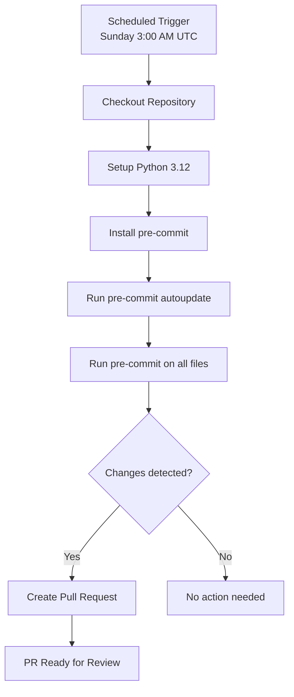

# Pre-commit Autoupdate Workflow Documentation

## Overview

The `pre-commit-autoupdate` workflow automates the maintenance of pre-commit hooks, ensuring that the development environment stays current with the latest versions.

## Purpose

- **Hook Maintenance**: Automatically update pre-commit hooks to latest versions
- **Consistency**: Maintain consistent hook versions across the team
- **Security Updates**: Apply security patches from hook updates
- **Developer Experience**: Ensure smooth development workflow

## Trigger Configuration

```yaml
on:
  schedule:
    - cron: "0 3 * * 0"  # Every Sunday at 3:00 AM UTC
```

**Trigger Events:**
- **Schedule**: Every Sunday at 3:00 AM UTC - automatic maintenance

## Workflow Architecture



## Job Details

### autoupdate

**Purpose**: Update pre-commit hooks and create PR if changes detected.

**Environment**: `ubuntu-latest`

**Permissions:**
- `contents: write` - To push changes
- `pull-requests: write` - To create PRs

**Key Steps:**

1. **Checkout Repository**
   ```yaml
   uses: actions/checkout@v4
   with:
     fetch-depth: 0
   ```

2. **Setup Python**
   ```yaml
   uses: actions/setup-python@v5
   with:
     python-version: "3.12"
   ```

3. **Install pre-commit**
   ```bash
   pip install pre-commit
   ```

4. **Run pre-commit autoupdate**
   ```bash
   pre-commit autoupdate
   ```

5. **Run pre-commit on all files**
   ```bash
   pre-commit run --all-files || true
   ```
   Note: `|| true` ensures the workflow continues even if some hooks fail (e.g., formatting changes).

6. **Create Pull Request**
   ```yaml
   uses: peter-evans/create-pull-request@v6
   with:
     branch: pre-commit-autoupdate
     commit-message: "chore(pre-commit): autoupdate hooks"
     title: "chore(pre-commit): autoupdate hooks"
     body: "Automated update of pre-commit hooks."
     committer: "pre-commit-bot <pre-commit-bot@users.noreply.github.com>"
     author: "pre-commit-bot <pre-commit-bot@users.noreply.github.com>"
   ```

## Configuration

### Schedule

The workflow runs weekly on Sundays at 3:00 AM UTC. This timing:
- Minimizes disruption during work hours
- Provides time for review before the work week
- Balances freshness with stability

### Branch Strategy

- **Branch Name**: `pre-commit-autoupdate`
- **Behavior**: Force-pushes to the same branch each run
- **Result**: Only one open PR at a time for hook updates

## Performance

| Metric | Value |
|--------|-------|
| Typical Duration | 1-3 minutes |
| Runner | `ubuntu-latest` |
| Memory | Minimal |

## PR Workflow

When hooks are updated:

1. Workflow creates/updates the `pre-commit-autoupdate` branch
2. PR is created with title `chore(pre-commit): autoupdate hooks`
3. Team reviews the hook version changes
4. Merge when ready

If no updates are available:
- No branch is created/updated
- No PR is created
- Workflow completes silently

## Troubleshooting

### Common Issues

**Hook update failures:**
- Check if upstream hook repositories are accessible
- Verify `.pre-commit-config.yaml` syntax

**PR creation failures:**
- Verify `GITHUB_TOKEN` permissions
- Check if branch protection rules allow bot commits

**Pre-commit run failures:**
- `|| true` ensures these don't block PR creation
- Review the workflow logs for specific hook failures
- Hook failures may indicate code that needs formatting

## Related Documentation

- [Pull Request Analysis Workflow](pull-request-analysis.md)
- [Main Analysis Workflow](main-analysis.md)
- [Main README](README.md)
