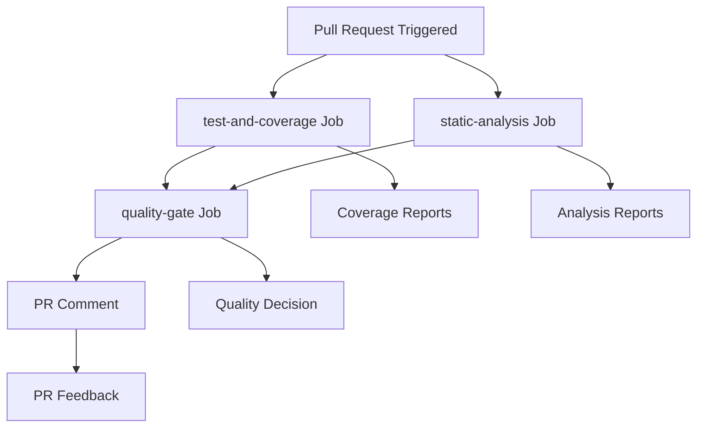
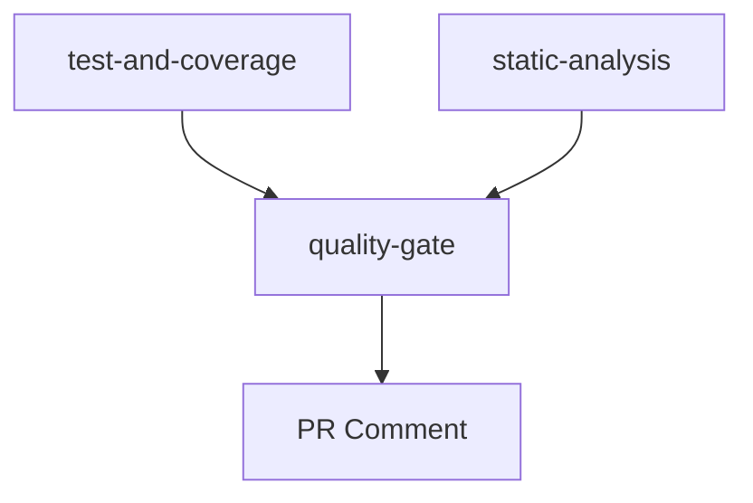

# Pull Request Analysis Workflow Documentation

## Overview

The `pull-request-analysis` workflow runs on pull requests to the `main` branch, executing a **streamlined and independent analysis pipeline**. The workflow prioritizes simplicity and reliability by allowing each job to manage its own build process, similar to the main-analysis workflow, while providing comprehensive quality feedback through PR comments.

This design eliminates complex build artifact sharing between jobs, ensuring each analysis tool operates independently while maintaining fast parallel execution where possible.

## Key Principles

- **Job Independence**: Each job manages its own build process.
- **No Build Sharing**: Eliminates complex upload/download of build artifacts.
- **Parallel Execution**: Independent jobs can run simultaneously.
- **PR Feedback**: Comprehensive quality reporting directly in pull requests.
- **Simplified Architecture**: Clean separation of concerns between testing, analysis, and reporting.

## Purpose

- **Code Quality**: Enforce coding standards and best practices.
- **Security**: Detect potential security issues and secrets.
- **Testing**: Ensure test coverage meets quality standards.
- **Quality Gates**: Prevent low-quality code from merging.
- **PR Communication**: Provide actionable feedback in pull requests.

## Trigger Configuration

```yaml
on:
  pull_request:
    branches: [ main ]
    types: [ opened, synchronize, reopened ]
    if: github.actor != 'dependabot[bot]'
```

**Trigger Events:**
- `opened`: New PR created - initial analysis
- `synchronize`: New commit pushed - re-analyze changes
- `reopened`: Previously closed PR reopened - full analysis
- **Dependabot Skip**: Automatic exclusion for dependency updates

## Workflow Architecture



## Job Dependencies



**Execution Strategy:**
- **Independent Jobs**: `test-and-coverage` and `static-analysis` run in parallel.
- **Simple Dependencies**: Only `quality-gate` depends on both jobs.
- **No Build Sharing**: Each job creates its own build as needed.

## Jobs Detailed

### 1. Test and Coverage Job

**Purpose**: Execute tests and generate coverage reports.

**Key Steps:**
- Setup Swift toolchain.
- Restore SwiftPM cache (`.build`).
- Run tests with coverage:

```bash
swift test --enable-code-coverage --quiet
```

- Generate LCOV and coverage percentage reports.
- Upload `coverage/` artifacts for quality gate.

**Rationale:**
- Tests provide the primary validation of code functionality.
- Coverage generation is integrated with test execution.
- SwiftPM caching optimizes performance.

### 2. Static Analysis Job

**Purpose**: Perform static analysis with independent build process.

**Key Tools:**
- SwiftLint (code style and linting)
- Periphery (dead-code detection)
- Gitleaks (secret scanning)

**Tool Execution:**

```bash
# SwiftLint
swiftlint lint --reporter json > reports/swiftlint.json

# Periphery (independent build)
periphery scan --format json > reports/periphery.json

# Gitleaks
gitleaks detect --report-path reports/gitleaks.sarif --report-format sarif
```

**Rationale:**
- Each tool manages its own build process for maximum reliability.
- No dependency on external build artifacts.
- Simplified debugging and execution.

### 3. Quality Gate Job

**Purpose**: Evaluate all metrics against quality thresholds and provide PR feedback.

**Key Steps:**
- Download coverage and analysis artifacts.
- Evaluate metrics against configurable thresholds.
- Generate quality report.
- Create or update PR comment with results.

**Quality Gate Logic:**
```bash
# Coverage check
if (( $(echo "$COVERAGE < $THRESHOLD" | bc -l) )); then
  COVERAGE_STATUS="x"
  FAIL=1
fi

# Security check
if [ "$SECRETS_COUNT" -gt 0 ] && [ "$FAIL_SECRETS" = "true" ]; then
  SECRETS_STATUS="x"
  FAIL=1
fi
```

**PR Comment Features:**
- **Smart Updates**: Updates existing comments instead of creating duplicates.
- **Quality Metrics Table**: Clear formatting of all metrics.
- **Status Indicators**: Visual feedback (✓/✗) for each metric.
- **Configurable Thresholds**: Respects repository-level settings.

## Configuration

### Environment Variables

| Variable | Default | Description |
|----------|---------|-------------|
| `COVERAGE_THRESHOLD` | 95% | Minimum coverage percentage |
| `MAX_LINT_VIOLATIONS` | 10 | Maximum allowed lint violations |
| `MAX_DEAD_CODE` | 0 | Maximum allowed dead code findings |
| `FAIL_ON_SECRETS` | true | Fail build on secrets found |
| `STRICT_MODE` | false | Enable strict quality enforcement |

### Repository Setup

**Required Files:**
- `.github/workflows/pull-request-analysis.yml`
- `.swiftlint.yml` - SwiftLint configuration
- `.periphery.yml` - Periphery configuration  
- `.gitleaks.toml` - Gitleaks configuration

**Required Secrets:**
- `GITHUB_TOKEN` - GitHub API access (built-in)

## Performance Characteristics

### Design Trade-offs

| Dimension | Decision | Rationale |
|----------|---------|----------|
| Build Strategy | Independent builds per job | Maximum reliability and simplicity |
| Artifact Sharing | Disabled | Eliminates complexity and potential failures |
| Job Dependencies | Minimal | Enables parallel execution |
| PR Integration | Native GitHub API | Seamless developer experience |
| Error Isolation | Per-job | Failures don't cascade between jobs |

### Expected Performance

| Pipeline Variant | Relative Speed |
|-----------------|---------------|
| Independent jobs (current) | Fastest (parallel execution) |
| Shared artifacts | Slower (sequential dependencies) |
| Redundant builds | Slowest (duplicate work) |

## Resource Requirements

**Runner Specifications:**
- **Type**: `macos-26`
- **Memory**: 16GB recommended
- **Timeout**: 30 minutes

## Best Practices

1. **Keep jobs independent**: Avoid sharing build artifacts between jobs.
2. **Enable parallel execution**: Structure dependencies to allow concurrent runs.
3. **Simplify artifact management**: Only share final reports, not build artifacts.
4. **Self-contained builds**: Each job should handle its own setup.
5. **Provide clear PR feedback**: Make quality metrics actionable and visible.

## Future Improvements (Realistic)

- Enhanced caching strategies for independent builds.
- Selective analysis based on changed files.
- Improved test parallelization.
- Advanced PR feedback with actionable suggestions.

## Related Documentation

- [Main Analysis Workflow](main-analysis.md)
- [Pre-commit Autoupdate Workflow](pre-commit-autoupdate.md)
- [Main README](README.md)
