# Pull Request Analysis Workflow Documentation

## Overview

The `pull-request-analysis` workflow is the primary CI/CD pipeline that runs on every pull request to ensure code quality, security, test coverage, and maintainability before merging changes into the main branch.

## Purpose

- **Code Quality**: Enforce coding standards and best practices
- **Security**: Detect potential security issues and secrets
- **Testing**: Ensure test coverage meets quality standards
- **Quality Gates**: Prevent low-quality code from merging
- **Reporting**: Provide comprehensive quality feedback

## Trigger Configuration

```yaml
on:
  pull_request:
    branches: [ main ]
    types: [ opened, synchronize, reopened ]
```

**Trigger Events:**
- `opened`: New PR created - initial analysis
- `synchronize`: New commit pushed - re-analyze changes
- `reopened`: Previously closed PR reopened - full analysis

## Workflow Architecture


## Job Dependencies


**Execution Flow:**
1. **build-and-test**: Foundation - builds, tests, generates coverage
2. **static-analysis**: Parallel - runs analysis tools
3. **quality-gate**: Coordination - evaluates all results
4. **pr-comment**: Communication - provides feedback

## Jobs Detailed

### 1. Build and Test Job

**Purpose**: Build project, run tests, generate coverage reports


**Key Responsibilities:**
- **Build Compilation**: Ensure code compiles with Swift 6.2
- **Test Execution**: Run full XCTest suite with coverage
- **Coverage Generation**: Create LCOV and regions coverage (99.28%)
- **Artifact Creation**: Package results for downstream jobs

**Coverage Process:**
```bash
# LCOV for SonarQube
xcrun llvm-cov export ... --format=lcov > coverage/lcov.info

# Regions coverage for quality gate (99.28%)
xcrun llvm-cov report ... | grep "TOTAL" | awk '{print $4}' > coverage/regions-percent.txt
```

**Performance Optimizations:**
- SwiftPM caching with Package.resolved hash
- Parallel test execution
- Efficient coverage generation

### 2. Static Analysis Job

**Purpose**: Comprehensive code quality and security analysis


**Analysis Tools:**

#### SwiftLint
- **Purpose**: Enforce Swift coding standards
- **Configuration**: `.swiftlint.yml`
- **Output**: `reports/swiftlint.json`
- **Threshold**: ≤ 10 violations

#### Periphery
- **Purpose**: Detect unused/dead code
- **Configuration**: `.periphery.yml`
- **Output**: `reports/periphery.json`
- **Threshold**: 0 findings

#### Gitleaks
- **Purpose**: Security scanning for secrets
- **Configuration**: `.gitleaks.toml`
- **Output**: `reports/gitleaks.sarif`
- **Threshold**: 0 findings

**Parallel Execution:**
- Tools run independently for efficiency
- Graceful failure handling (`|| true`)
- Comprehensive coverage of quality aspects

### 3. Quality Gate Job

**Purpose**: Evaluate all metrics against quality thresholds


**Quality Gate Logic:**

```mermaid
flowchart TD
    A[Start Evaluation] --> B[Coverage: 99.28% ≥ 95%?]
    B -->|Yes| C[Lint: 0 ≤ 10?]
    B -->|No| D[❌ Fail]
    C -->|Yes| E[Dead Code: 0 ≤ 0?]
    C -->|No| D
    E -->|Yes| F[Secrets: 0 = 0?]
    E -->|No| D
    F -->|Yes| G[✅ Pass]
    F -->|No| D
    
    style G fill:#4caf50
    style D fill:#f44336
```


**Metrics Evaluation:**

| Metric | Source | Target | Current | Status |
|--------|--------|--------|---------|--------|
| Coverage | `regions-percent.txt` | ≥ 95% | 99.28% | ✅ |
| Lint Violations | `swiftlint.json` | ≤ 10 | 0 | ✅ |
| Dead Code | `periphery.json` | ≤ 0 | 0 | ✅ |
| Secrets | `gitleaks.sarif` | 0 | 0 | ✅ |

**Report Generation:**
- Single source of truth markdown file
- Consistent formatting across locations
- Debug output for troubleshooting

### 4. PR Comment Job

**Purpose**: Provide quality feedback directly in pull request


**Comment Management:**
- **Smart Updates**: Find and update existing comments
- **Marker System**: Use HTML comments for identification
- **Consistent Content**: Reuse quality report file
- **Professional Format**: Clean markdown tables

**Comment Features:**
- Quality metrics table
- Status indicators (✅/❌)
- Download links for detailed reports
- Strict mode indication

## Configuration

### Environment Variables

| Variable | Default | Description |
|----------|---------|-------------|
| `COVERAGE_THRESHOLD` | 95 | Minimum coverage percentage |
| `MAX_LINT_VIOLATIONS` | 10 | Maximum allowed lint violations |
| `MAX_DEAD_CODE` | 0 | Maximum allowed dead code findings |
| `FAIL_ON_SECRETS` | true | Fail build on secrets found |
| `STRICT_MODE` | false | Enable strict quality enforcement |

### Repository Setup

**Required Files:**
- `.github/workflows/pull-request-analysis.yml`
- `.swiftlint.yml` - SwiftLint configuration
- `.periphery.yml` - Periphery configuration  
- `.gitleaks.toml` - Gitleaks configuration

**Required Secrets:**
- `GITHUB_TOKEN` - GitHub API access (built-in)
- `SONAR_TOKEN` - SonarCloud integration (optional)

## Performance Metrics

### Execution Time

| Job | Average Time | Optimization |
|------|---------------|-------------|
| build-and-test | 5-8 minutes | SwiftPM caching |
| static-analysis | 2-4 minutes | Parallel tool execution |
| quality-gate | 1-2 minutes | Efficient parsing |
| pr-comment | 30-60 seconds | Reuse reports |
| **Total** | **8-14 minutes** | **Overall optimization** |

### Resource Usage

**Runner Requirements:**
- **Type**: `macos-26`
- **Memory**: 7GB minimum
- **Storage**: 10GB for build artifacts
- **Timeout**: 30 minutes per job

## Quality Metrics

### Current Performance


### Trend Analysis

**Historical Performance:**
- Coverage consistency: 99.28% ± 0.5%
- Lint violations: Typically 0-2
- Dead code: Usually 0
- Security issues: Always 0 (goal)

## Integration Points

### External Services


### Data Flow


## Error Handling

### Common Failure Scenarios

#### Build Failures
- **Symptoms**: Compilation errors, test failures
- **Impact**: Workflow stops at build-and-test
- **Recovery**: Fix code issues, push new commit

#### Quality Gate Failures
- **Symptoms**: Coverage too low, too many violations
- **Impact**: PR blocked from merging
- **Recovery**: Address quality issues, re-run

#### Tool Failures
- **Symptoms**: Analysis tool crashes, missing reports
- **Impact**: Incomplete analysis
- **Recovery**: Graceful degradation, manual review

### Debug Features

**Debug Output:**
```bash
🔍 DEBUG: Regions Coverage from file = 99.28%
🔍 DEBUG: LINT_COUNT=0, DEAD_CODE_COUNT=0, SECRETS_COUNT=0
🔍 DEBUG: FAIL=0
```

**Log Analysis:**
- Structured logging with emojis
- Clear error messages
- Performance timing information

## Best Practices

### Workflow Design

1. **Parallel Execution**: Run independent jobs simultaneously
2. **Artifact Reuse**: Share data efficiently between jobs
3. **Graceful Failures**: Continue analysis despite individual tool failures
4. **Consistent Reporting**: Single source of truth for quality metrics

### Quality Standards

1. **High Coverage**: Target 99.28% regions coverage
2. **Zero Tolerance**: No secrets or critical issues
3. **Clean Code**: Minimize lint violations and dead code
4. **Fast Feedback**: Provide quick, actionable feedback

### Maintenance

1. **Regular Updates**: Keep tools and actions current
2. **Threshold Review**: Adjust quality targets as needed
3. **Performance Monitoring**: Track execution times and success rates
4. **Documentation**: Keep configuration and processes documented

## Future Enhancements

### Planned Improvements

1. **Performance**: Parallel test execution, incremental builds
2. **Advanced Analysis**: Complexity metrics, duplication detection
3. **Automation**: Auto-merge for passing quality gates
4. **Integration**: Slack/Teams notifications, dashboard integration

### Scaling Considerations

- **Large Repositories**: Incremental analysis, smart caching
- **Multiple Environments**: Staging/production workflows
- **Cross-Platform**: Linux/Windows runner support
- **Container Support**: Docker-based build environments

## Related Documentation

- [Main Analysis Workflow](main-analysis.md)
- [Pre-commit Autoupdate Workflow](pre-commit-autoupdate.md)
- [Main README](README.md)
