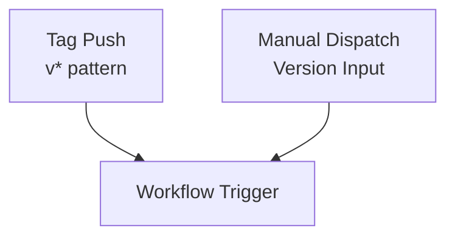
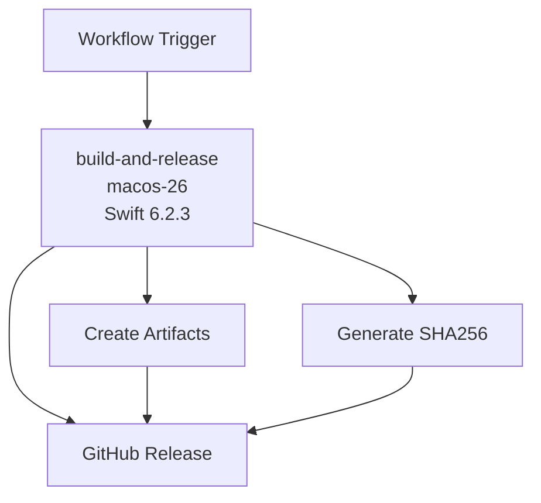

# Release Workflow Documentation

## Overview

The `release` workflow automates the complete release process for Swift Structure, building the binary, creating GitHub releases, and opening a Pull Request to update the Homebrew Tap formula.

## Trigger Configuration

```yaml
on:
  push:
    tags:
      - "v*"
  workflow_dispatch:
    inputs:
      version:
        description: 'Release version (e.g., 1.0.0)'
        required: true
        type: string
```

**Trigger Events:**
- `push`: Any tag push matching `v*` pattern - automatic release
- `workflow_dispatch`: Manual trigger for on-demand releases with version input (accepts both `1.0.0` and `v1.0.0` formats)

## Workflow Architecture

### Trigger Flow


### Main Release Pipeline


### Distribution & Notification


## Jobs

### 1. build-and-release

**Purpose**: Build, test, and create release artifacts

**Environment**: `macos-26` with Swift 6.2.3

**Outputs:**
- `version`: The determined version (e.g., `v1.0.0`)
- `artifact_name`: The artifact filename (e.g., `swift-structure-v1.0.0-macos.tar.gz`)

**Key Steps:**
- Checkout repository
- Setup Swift environment
- **Determine version**: Handles both tag push and workflow_dispatch triggers
  - For tag push: uses `github.ref_name`
  - For workflow_dispatch: uses input version, adds `v` prefix if missing
  - Validates format matches `v1.2.3` pattern
- Generate changelog from git history
- Build release binary
- Create release artifact
- Generate SHA256 checksum
- Create GitHub release with tag

### 2. update-homebrew-tap

**Purpose**: Create a Pull Request to update the Homebrew Tap formula

**Environment**: `ubuntu-latest`

**Dependencies**: `build-and-release` job

**Action**: `mislav/bump-homebrew-formula-action@v3`

**Configuration:**
```yaml
formula-name: swift-structure
homebrew-tap: ericodx/homebrew-tap
base-branch: main
create-pullrequest: true
```

**Key Steps:**
- Calculate new SHA256 from release artifact URL
- Create a branch in the Homebrew Tap repository
- Update formula with new version, URL, and SHA256
- Open a Pull Request for review

**PR Commit Message Format:**
```
swift-structure v1.0.0

- Update version to v1.0.0
- Update download URL and SHA256

Release: https://github.com/ericodx/swift-structure/releases/tag/v1.0.0
```

### 3. notify

**Purpose**: Provide release summary and notifications

**Environment**: `ubuntu-latest`

**Dependencies**: All jobs (`always()` condition)

**Key Steps:**
- Generate release summary with task completion status
- Report Homebrew Tap PR creation status
- Provide installation instructions
- Include links to release and Homebrew Tap
- Notify on failure with error details

## Environment Variables

| Variable | Value | Description |
|----------|-------|-------------|
| `BINARY_NAME` | `SwiftStructure` | Name of the binary executable |

**Job Outputs (build-and-release):**

| Output | Example | Description |
|--------|---------|-------------|
| `version` | `v1.0.0` | Determined version with `v` prefix |
| `artifact_name` | `swift-structure-v1.0.0-macos.tar.gz` | Release artifact filename |

## Secrets Required

| Secret | Purpose | Required For |
|--------|---------|--------------|
| `GITHUB_TOKEN` | GitHub API access | Release creation |
| `TAP_GITHUB_TOKEN` | Homebrew Tap repository access | Formula PR creation |

**TAP_GITHUB_TOKEN Permissions:**
- Must be a Personal Access Token (classic)
- Required scopes: `repo` and `workflow`
- Must have write access to `ericodx/homebrew-tap` repository

## Release Process Flow

### Automated Release (Tag Push)
1. Create and push tag: `git tag v1.0.0 && git push origin v1.0.0`
2. Workflow triggers automatically
3. **Determine version** from tag name
4. Build binary and create artifacts
5. Generate SHA256 checksum
6. Create GitHub release
7. **Create PR** to update Homebrew Tap formula
8. Generate release summary

### Manual Release (workflow_dispatch)
1. Trigger workflow manually with version input (e.g., `1.0.0` or `v1.0.0`)
2. **Determine version** from input, add `v` prefix if missing
3. Build binary and create artifacts
4. Generate SHA256 checksum
5. Create GitHub release with determined tag
6. **Create PR** to update Homebrew Tap formula
7. Generate release summary

### Post-Release (Manual)
1. Review the PR created in `ericodx/homebrew-tap`
2. Merge the PR to make the new version available via Homebrew
3. Users can then install/upgrade: `brew upgrade swift-structure`

## Release Artifacts

- `swift-structure-v1.0.0-macos.tar.gz` - Binary distribution
- `SHA256.txt` - Checksum verification file

## Troubleshooting

### Common Issues

#### Build Failures
- **Symptoms**: Swift compilation errors
- **Recovery**: Check Swift version compatibility, fix build errors

#### Artifact Issues
- **Symptoms**: Missing or corrupted artifacts
- **Recovery**: Verify build process, check file permissions

#### Homebrew PR Creation Failures
- **Symptoms**: PR not created or action fails
- **Possible Causes**:
  - `TAP_GITHUB_TOKEN` missing or expired
  - Token lacks `repo` or `workflow` scopes
  - No write access to `ericodx/homebrew-tap`
  - Release artifact URL not accessible yet
- **Recovery**:
  - Verify token permissions in GitHub Settings → Developer settings → Personal access tokens
  - Ensure the release was created successfully before the PR job runs
  - Check if a PR already exists for this version

#### Permission Issues
- **Symptoms**: Authentication failures
- **Recovery**: Verify GitHub tokens and repository permissions
