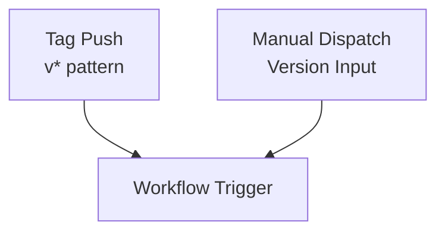
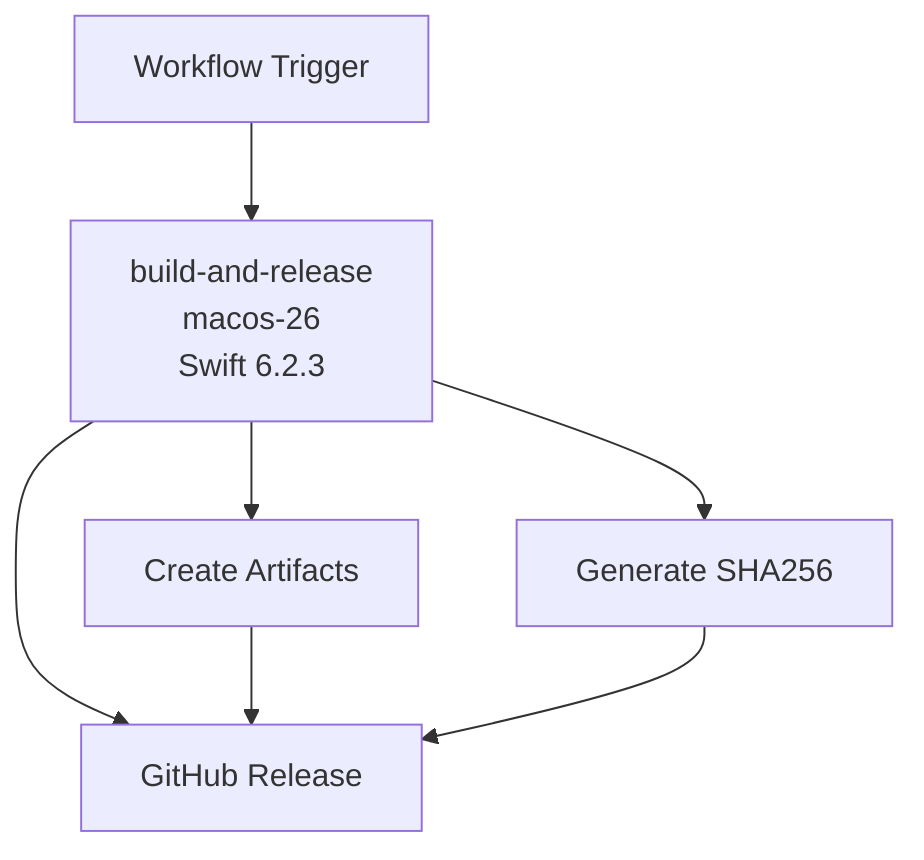
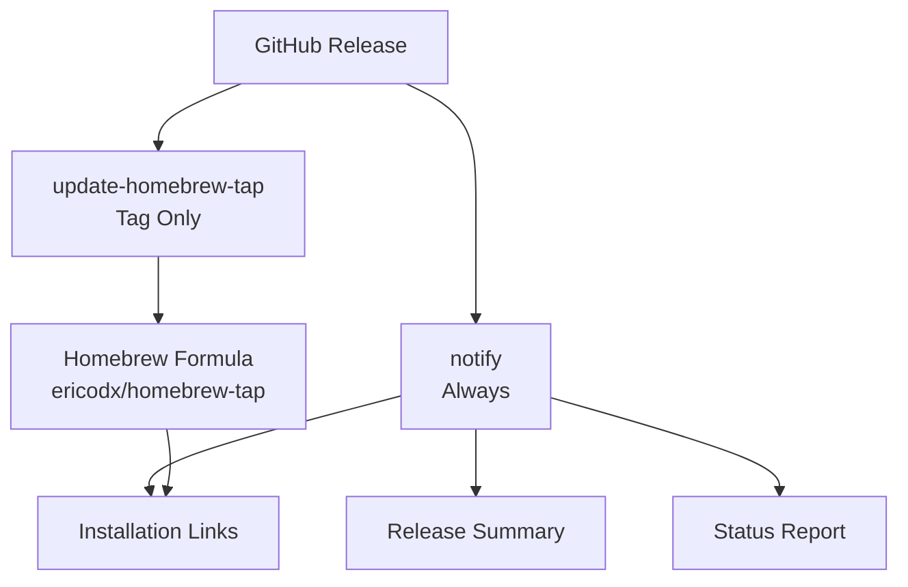

# Release Workflow Documentation

## Overview

The `release` workflow automates the complete release process for Swift Structure, building the binary, creating GitHub releases, and updating the Homebrew Tap formula.

## Trigger Configuration

```yaml
on:
  push:
    tags:
      - "v*"
  workflow_dispatch:
    inputs:
      version:
        description: 'Release version (e.g., 1.0.0)'
        required: true
        type: string
```

**Trigger Events:**
- `push`: Any tag push matching `v*` pattern - automatic release
- `workflow_dispatch`: Manual trigger for on-demand releases with version input

## Workflow Architecture

### Trigger Flow


### Main Release Pipeline


### Distribution & Notification


## Jobs

### 1. build-and-release

**Purpose**: Build, test, and create release artifacts

**Environment**: `macos-26` with Swift 6.2.3

**Key Steps:**
- Checkout repository
- Setup Swift environment
- Build release binary
- Create release artifact
- Generate SHA256 checksum
- Create GitHub release

### 2. update-homebrew-tap

**Purpose**: Update Homebrew Tap formula with new release

**Environment**: `ubuntu-latest`

**Dependencies**: `build-and-release` job

**Key Steps:**
- Update Homebrew formula using `mislav/bump-homebrew-formula-action`
- Update download URL with new release artifact
- Commit formula changes to Homebrew Tap repository

### 3. notify

**Purpose**: Provide release summary and notifications

**Environment**: `ubuntu-latest`

**Dependencies**: All jobs (`always()` condition)

**Key Steps:**
- Generate release summary with task completion status
- Provide installation instructions
- Include links to release and Homebrew Tap
- Notify on failure with error details

## Environment Variables

| Variable | Value | Description |
|----------|-------|-------------|
| `BINARY_NAME` | `swift-structure` | Name of the binary executable |
| `ARTIFACT_NAME` | `swift-structure-${{ github.ref_name }}-macos.tar.gz` | Release artifact filename |

## Secrets Required

| Secret | Purpose | Required For |
|--------|---------|--------------|
| `GITHUB_TOKEN` | GitHub API access | Release creation |
| `TAP_GITHUB_TOKEN` | Homebrew Tap repository access | Formula updates |

## Release Process Flow

### Automated Release (Tag Push)
1. Create and push tag: `git tag v1.0.0 && git push origin v1.0.0`
2. Workflow triggers automatically
3. Build binary and create artifacts
4. Generate SHA256 checksum
5. Create GitHub release
6. Update Homebrew Tap formula
7. Generate release summary

### Manual Release
1. Trigger workflow manually with version input
2. Build binary and create artifacts
3. Generate SHA256 checksum
4. Create GitHub release
5. Generate release summary (no Homebrew update)

## Release Artifacts

- `swift-structure-v1.0.0-macos.tar.gz` - Binary distribution
- `SHA256.txt` - Checksum verification file

## Troubleshooting

### Common Issues

#### Build Failures
- **Symptoms**: Swift compilation errors
- **Recovery**: Check Swift version compatibility, fix build errors

#### Artifact Issues
- **Symptoms**: Missing or corrupted artifacts
- **Recovery**: Verify build process, check file permissions

#### Homebrew Update Failures
- **Symptoms**: Formula update errors
- **Recovery**: Check TAP_GITHUB_TOKEN, verify Homebrew Tap access

#### Permission Issues
- **Symptoms**: Authentication failures
- **Recovery**: Verify GitHub tokens and repository permissions
