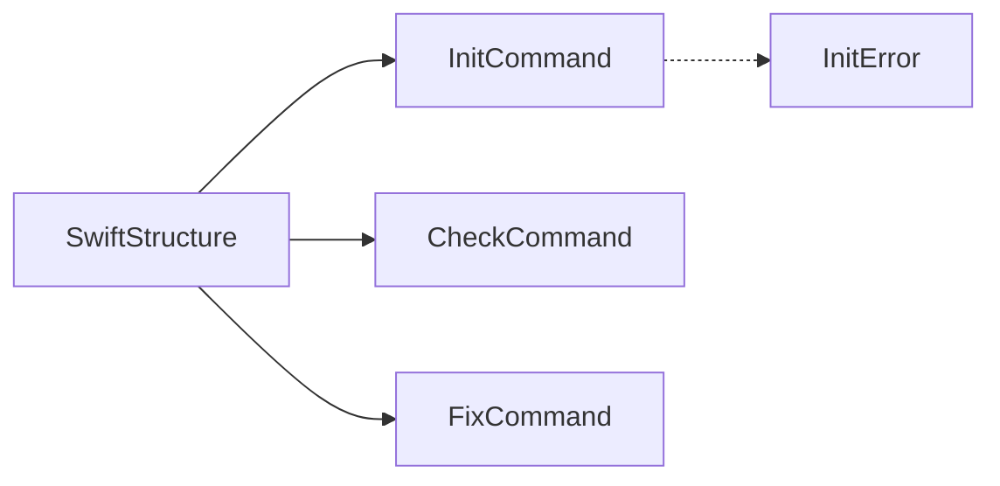
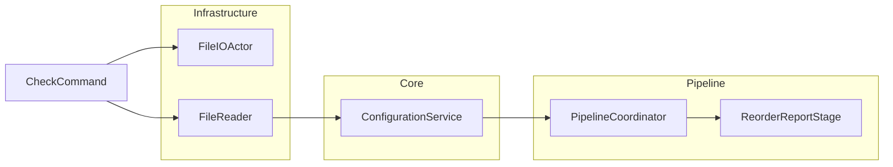
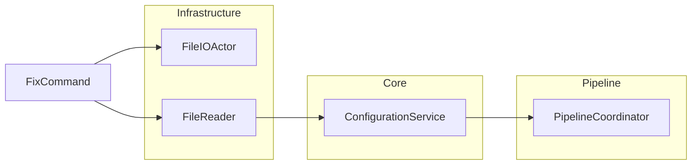

# Commands Documentation

Implementation documentation for Swift Structure CLI commands.

## Source Structure

```text
Sources/SwiftStructure/
├── SwiftStructure.swift
└── Commands/
    ├── CheckCommand.swift
    ├── FixCommand.swift
    ├── InitCommand.swift
    └── InitError.swift
```

## Documents

| Document | Source File | Description |
|----------|-------------|-------------|
| [SwiftStructure](../SwiftStructure.md) | `SwiftStructure.swift` | CLI entry point |
| [InitCommand](InitCommand.md) | `Commands/InitCommand.swift` | Configuration initialization |
| [CheckCommand](CheckCommand.md) | `Commands/CheckCommand.swift` | File analysis |
| [FixCommand](FixCommand.md) | `Commands/FixCommand.swift` | File reordering |
| [InitError](InitError.md) | `Commands/InitError.swift` | Error types |
| [Usage](Usage.md) | - | User-facing documentation |

## Dependency Diagrams

### Command Hierarchy



### CheckCommand Dependencies



### FixCommand Dependencies



## Shared Patterns

All async commands (`CheckCommand`, `FixCommand`) follow the same initialization pattern with Swift 6 concurrency:

1. Create `FileIOActor` instance
2. Create `FileReader` instance
3. Create `ConfigurationService` with `FileReader`
4. Load configuration asynchronously using `await`
5. Create `PipelineCoordinator` with `FileIOActor` and `Configuration`
6. Execute operation
7. Process results
8. Return exit code

## Swift 6 Conformance

All commands are designed to work with Swift 6 strict concurrency:

- ✓ **Async/await**: Configuration loading uses modern concurrency
- ✓ **Actor isolation**: File operations use `FileIOActor`
- ✓ **Sendable**: All dependencies are Sendable where appropriate
- ✓ **Strict mode**: Compatible with Swift 6 strict concurrency
