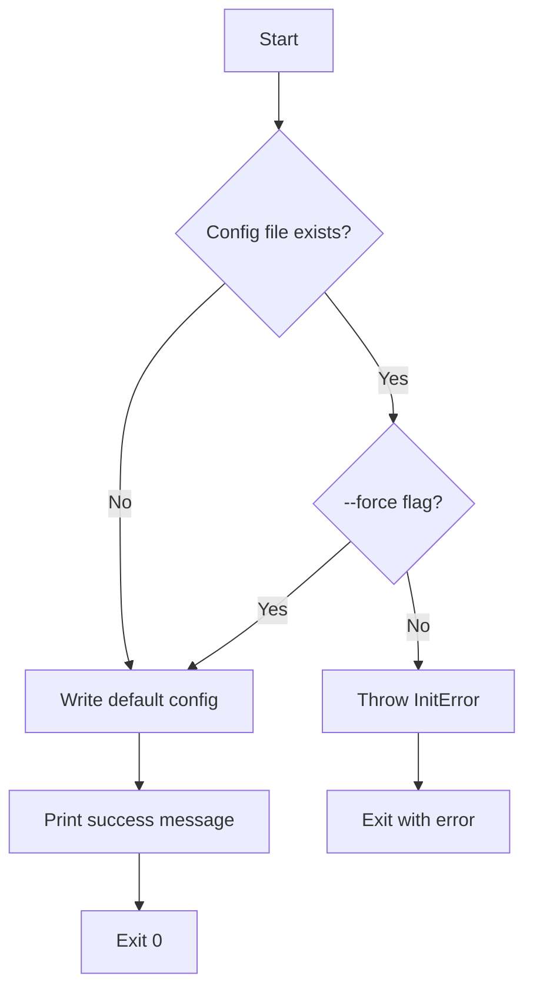
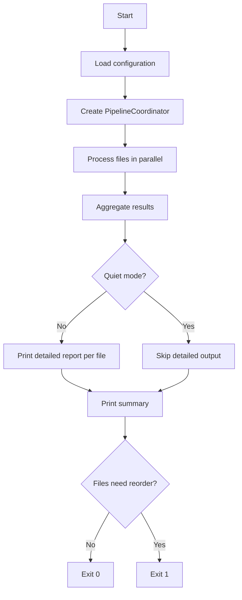
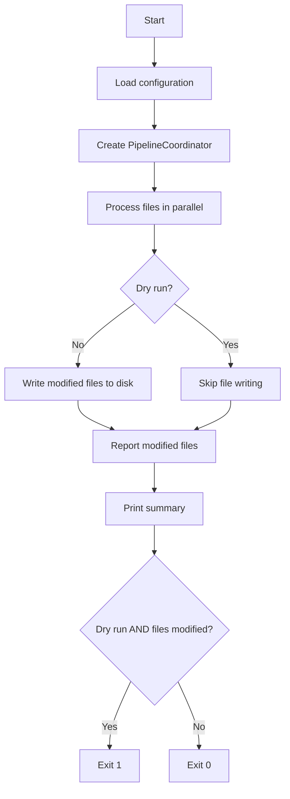
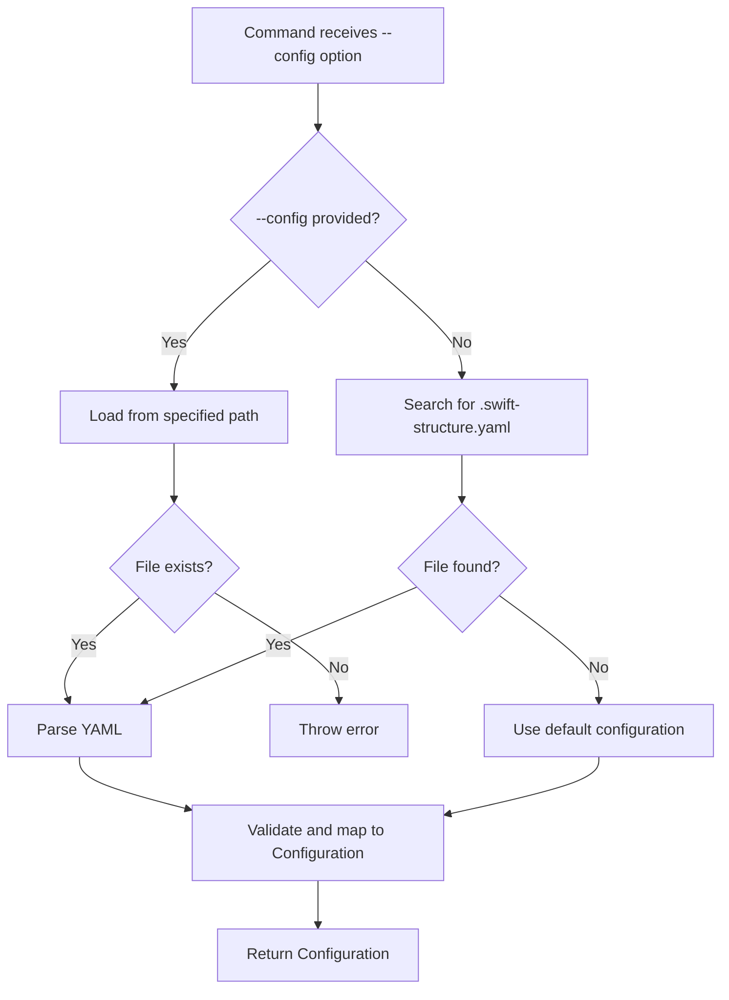

# CLI Commands

This document describes the command-line interface of Swift Structure, including all available commands, their options, and behaviors.

## Table of Contents

- [Overview](#overview)
- [Entry Point](#entry-point)
- [Commands](#commands)
  - [init](#init)
  - [check](#check)
  - [fix](#fix)
- [Exit Codes](#exit-codes)
- [Configuration Loading](#configuration-loading)

## Overview

Swift Structure provides three commands for managing Swift code structure:

| Command | Purpose |
|---------|---------|
| `init` | Create a default configuration file |
| `check` | Analyze files and report ordering violations |
| `fix` | Apply member reordering to files |

## Entry Point

The CLI entry point is defined in `SwiftStructure.swift`:

| Property | Value |
|----------|-------|
| **Command name** | `swift-structure` |
| **Current version** | 1.0.0 |
| **Protocol** | `AsyncParsableCommand` |
| **Subcommands** | `InitCommand`, `CheckCommand`, `FixCommand` |

The root command provides help and version information but delegates all operations to subcommands.

## Commands

### init

Creates a default `.swift-structure.yaml` configuration file in the current directory.

**File**: `InitCommand.swift`

#### Options

| Option | Type | Default | Description |
|--------|------|---------|-------------|
| `--force` | Flag | `false` | Overwrite existing configuration file |

#### Behavior



#### Default Configuration

The generated configuration includes:

- **version**: 1
- **ordering.members**: Default member order (typealias → deinitializer)
- **extensions.strategy**: separate
- **extensions.respect_boundaries**: true

#### Error Handling

| Error | Condition | Message |
|-------|-----------|---------|
| `InitError.configAlreadyExists` | File exists without `--force` | "Configuration file already exists at {path}. Use --force to overwrite." |

---

### check

Analyzes Swift files and reports which types need member reordering.

**File**: `CheckCommand.swift`

#### Arguments

| Argument | Type | Required | Description |
|----------|------|----------|-------------|
| `files` | `[String]` | Yes | Swift source files to analyze |

#### Options

| Option | Short | Type | Default | Description |
|--------|-------|------|---------|-------------|
| `--config` | `-c` | String? | nil | Path to configuration file |
| `--quiet` | `-q` | Flag | false | Only show files that need reordering |

#### Behavior



#### Output Modes

**Normal mode** (default):
- Prints detailed report for each file showing types and their members
- Shows which members are out of order
- Prints summary with total counts

**Quiet mode** (`--quiet`):
- Only prints paths of files needing reorder
- Prints summary

#### Summary Messages

| Condition | Message |
|-----------|---------|
| All ordered | `✓ All {n} types in {m} files are correctly ordered` |
| Needs reorder | `✗ {n} types in {m} files need reordering` |

---

### fix

Applies member reordering to Swift files.

**File**: `FixCommand.swift`

#### Arguments

| Argument | Type | Required | Description |
|----------|------|----------|-------------|
| `files` | `[String]` | Yes | Swift source files to fix |

#### Options

| Option | Short | Type | Default | Description |
|--------|-------|------|---------|-------------|
| `--config` | `-c` | String? | nil | Path to configuration file |
| `--dry-run` | - | Flag | false | Show changes without modifying files |
| `--quiet` | `-q` | Flag | false | Only show summary |

#### Behavior



#### Output Modes

**Normal mode**:
- Prints each modified file path
- Prefix: `Reordered: {path}` or `Would reorder: {path}` (dry-run)

**Quiet mode** (`--quiet`):
- Only prints summary

#### Dry Run Mode

When `--dry-run` is enabled:
- Files are processed but not written to disk
- Output shows what would change
- Exits with code 1 if any files would be modified (useful for CI)

#### Summary Messages

| Condition | Message |
|-----------|---------|
| All ordered | `✓ All {n} files already correctly ordered` |
| Modified (normal) | `✓ {n} files reordered` |
| Would modify (dry-run) | `⚠ {n} files would be modified` |

## Exit Codes

| Code | Command | Condition |
|------|---------|-----------|
| 0 | `init` | Configuration created successfully |
| 0 | `check` | All files correctly ordered |
| 0 | `fix` | Files reordered successfully (or none needed) |
| 1 | `init` | Configuration file exists (without `--force`) |
| 1 | `check` | One or more files need reordering |
| 1 | `fix --dry-run` | One or more files would be modified |

The exit code behavior enables CI/CD integration:

```bash
# Fail CI if files need reordering
swift-structure check Sources/**/*.swift

# Fail CI if fix would change anything (enforce pre-commit)
swift-structure fix --dry-run Sources/**/*.swift
```

## Configuration Loading

Both `check` and `fix` commands use `ConfigurationService` to load configuration:



### Search Paths

When no `--config` is specified, the service searches for `.swift-structure.yaml` in:

1. Current working directory
2. Parent directories (up to root)

If no configuration file is found, default configuration is used.
