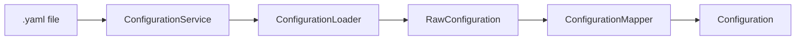

# Configuration Module

Handles loading, parsing, and mapping of YAML configuration files.

## Source Structure

```text
Sources/SwiftStructure/Core/Configuration/
├── Configuration.swift
├── ConfigurationService.swift
├── ConfigurationLoader.swift
├── ConfigurationMapper.swift
├── MemberOrderingRule.swift
├── RawConfiguration.swift
├── RawMemberRule.swift
├── ExtensionsStrategy.swift
└── MethodKind.swift
```

## Documents

| Document | Description |
|----------|-------------|
| [Configuration](Configuration.md) | Final validated configuration model |
| [ConfigurationService](ConfigurationService.md) | High-level configuration loading facade |
| [ConfigurationLoader](ConfigurationLoader.md) | YAML parsing to raw representation |
| [ConfigurationMapper](ConfigurationMapper.md) | Raw to validated configuration mapping |
| [MemberOrderingRule](MemberOrderingRule.md) | Rule matching logic for member ordering |
| [RawConfiguration](RawConfiguration.md) | Unvalidated configuration from YAML |
| [RawMemberRule](RawMemberRule.md) | Unvalidated member rule from YAML |
| [ExtensionsStrategy](ExtensionsStrategy.md) | Extension handling strategy enum |
| [MethodKind](MethodKind.md) | Method classification enum |

## Data Flow



## Design Pattern

The module follows a **Parser/Mapper** pattern:

1. **ConfigurationService**: Facade that orchestrates loading
2. **ConfigurationLoader**: Parses YAML into raw, unvalidated structs
3. **ConfigurationMapper**: Validates and maps raw structs to domain models

This separation enables:
- Independent testing of parsing vs. mapping
- Clear error boundaries (parse errors vs. validation errors)
- Easy extension for new configuration formats
