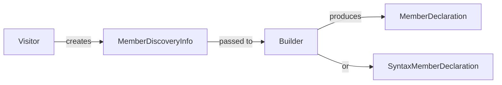

# MemberDiscoveryInfo

**Source**: `Sources/SwiftStructure/Core/Models/MemberDiscoveryInfo.swift`

Intermediate data captured during member discovery.

## Structure

| Component | Description |
|-----------|-------------|
| **Type** | `struct MemberDiscoveryInfo` |
| **Protocols** | `Sendable` |

## Properties

| Property | Type | Description |
|----------|------|-------------|
| `name` | `String` | Member identifier |
| `kind` | `MemberKind` | Classification |
| `position` | `AbsolutePosition` | Position in source |
| `item` | `MemberBlockItemSyntax` | Syntax node |
| `visibility` | `Visibility` | Access level |
| `isAnnotated` | `Bool` | Has attributes |

## Purpose

Carries all information needed by builders to create either:
- `MemberDeclaration` (lightweight)
- `SyntaxMemberDeclaration` (syntax-aware)

## Data Flow

## Related

- [UnifiedMemberDiscoveryVisitor](../Visitors/UnifiedMemberDiscoveryVisitor.md) - Creates this type
- [MemberOutputBuilder](../Visitors/Builders/MemberOutputBuilder.md) - Consumes this type
