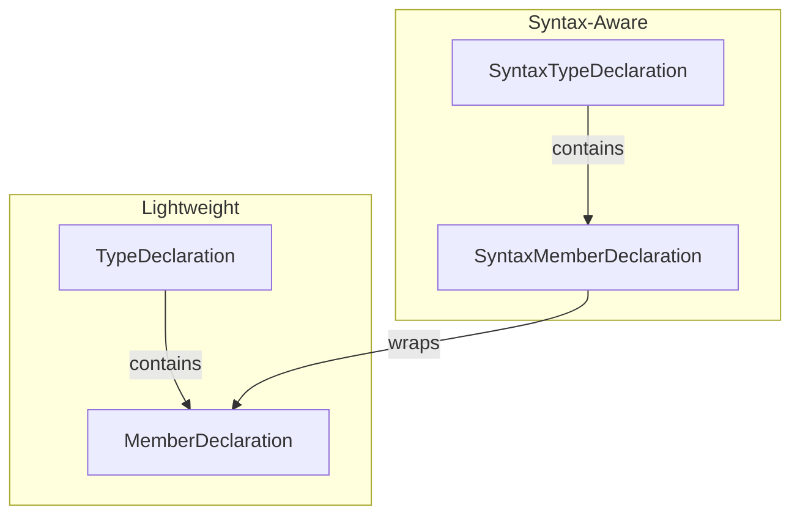

# Models Module

Domain models representing Swift type structures.

## Source Structure

```text
Sources/SwiftStructure/Core/Models/
├── MemberDeclaration.swift
├── TypeDeclaration.swift
├── SyntaxMemberDeclaration.swift
├── SyntaxTypeDeclaration.swift
├── MemberKind.swift
├── TypeKind.swift
├── Visibility.swift
├── MemberDiscoveryInfo.swift
└── TypeDiscoveryInfo.swift
```

## Documents

### Declaration Models

| Document | Description |
|----------|-------------|
| [MemberDeclaration](MemberDeclaration.md) | Lightweight member representation |
| [TypeDeclaration](TypeDeclaration.md) | Lightweight type representation |
| [SyntaxMemberDeclaration](SyntaxMemberDeclaration.md) | Member with syntax node reference |
| [SyntaxTypeDeclaration](SyntaxTypeDeclaration.md) | Type with syntax node reference |

### Enumerations

| Document | Description |
|----------|-------------|
| [MemberKind](MemberKind.md) | Member classification (property, method, etc.) |
| [TypeKind](TypeKind.md) | Type classification (struct, class, etc.) |
| [Visibility](Visibility.md) | Access level modifiers |

### Discovery Info

| Document | Description |
|----------|-------------|
| [MemberDiscoveryInfo](MemberDiscoveryInfo.md) | Intermediate data during member discovery |
| [TypeDiscoveryInfo](TypeDiscoveryInfo.md) | Intermediate data during type discovery |

## Model Hierarchy



## Design Pattern

Two parallel hierarchies serve different use cases:

- **Lightweight models** (`TypeDeclaration`, `MemberDeclaration`): For check operations that only report results
- **Syntax-aware models** (`SyntaxTypeDeclaration`, `SyntaxMemberDeclaration`): For fix operations that modify AST
