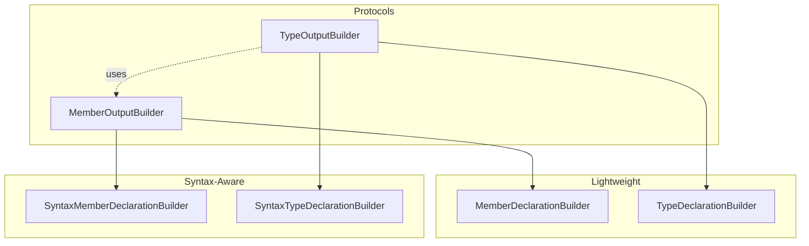

# Builders Module

Output builders for visitor pattern.

## Source Structure

```text
Sources/SwiftStructure/Core/Visitors/Builders/
├── MemberOutputBuilder.swift         # Protocol
├── TypeOutputBuilder.swift           # Protocol
├── MemberDeclarationBuilder.swift    # Lightweight member builder
├── TypeDeclarationBuilder.swift      # Lightweight type builder
├── SyntaxMemberDeclarationBuilder.swift  # Syntax-aware member builder
└── SyntaxTypeDeclarationBuilder.swift    # Syntax-aware type builder
```

## Documents

### Protocols

| Document | Description |
|----------|-------------|
| [MemberOutputBuilder](MemberOutputBuilder.md) | Protocol for member builders |
| [TypeOutputBuilder](TypeOutputBuilder.md) | Protocol for type builders |

### Lightweight Builders

| Document | Description |
|----------|-------------|
| [MemberDeclarationBuilder](MemberDeclarationBuilder.md) | Produces `MemberDeclaration` |
| [TypeDeclarationBuilder](TypeDeclarationBuilder.md) | Produces `TypeDeclaration` |

### Syntax-Aware Builders

| Document | Description |
|----------|-------------|
| [SyntaxMemberDeclarationBuilder](SyntaxMemberDeclarationBuilder.md) | Produces `SyntaxMemberDeclaration` |
| [SyntaxTypeDeclarationBuilder](SyntaxTypeDeclarationBuilder.md) | Produces `SyntaxTypeDeclaration` |

## Builder Hierarchy



## Design Pattern

**Strategy Pattern** via protocols:

- Visitors depend on builder protocols, not concrete types
- Different builders produce different output types
- Same visitor code, multiple output possibilities
