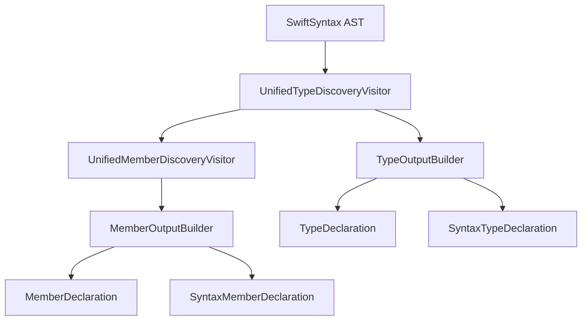

# Visitors Module

SwiftSyntax AST traversal for type and member discovery.

## Source Structure

```text
Sources/SwiftStructure/Core/Visitors/
├── UnifiedTypeDiscoveryVisitor.swift
├── UnifiedMemberDiscoveryVisitor.swift
└── Builders/
    ├── MemberOutputBuilder.swift
    ├── TypeOutputBuilder.swift
    ├── MemberDeclarationBuilder.swift
    ├── TypeDeclarationBuilder.swift
    ├── SyntaxMemberDeclarationBuilder.swift
    └── SyntaxTypeDeclarationBuilder.swift
```

## Documents

| Document | Description |
|----------|-------------|
| [UnifiedTypeDiscoveryVisitor](UnifiedTypeDiscoveryVisitor.md) | Discovers types in AST |
| [UnifiedMemberDiscoveryVisitor](UnifiedMemberDiscoveryVisitor.md) | Discovers members within types |
| [Builders](Builders/README.md) | Output builders for visitors |

## Architecture



## Design Pattern

**Generic Visitor with Pluggable Builders**

The visitors are generic over a builder type, allowing the same traversal logic to produce different output types:

- **Check mode**: Uses `TypeDeclarationBuilder` → produces `TypeDeclaration`
- **Fix mode**: Uses `SyntaxTypeDeclarationBuilder` → produces `SyntaxTypeDeclaration`

This avoids code duplication while maintaining type safety.

## Factory Methods

Visitors provide factory methods for common configurations:

- `forDeclarations(converter:)` - For check operations
- `forSyntaxDeclarations(converter:)` - For fix operations
