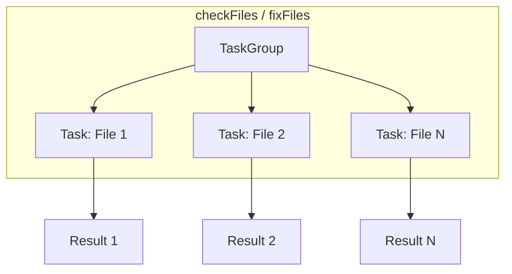

# PipelineCoordinator

**Source**: `Sources/SwiftStructure/Pipeline/PipelineCoordinator.swift`

Actor that coordinates async file processing through pipelines.

## Structure

| Component | Description |
|-----------|-------------|
| **Type** | `actor PipelineCoordinator` |

## Properties

| Property | Type | Description |
|----------|------|-------------|
| `fileIO` | `FileIOActor` | File I/O operations |
| `configuration` | `Configuration` | Ordering configuration |

## Initializer

| Parameter | Type | Description |
|-----------|------|-------------|
| `fileIO` | `FileIOActor` | File I/O actor |
| `configuration` | `Configuration` | Configuration instance |

## Nested Types

### CheckResult

| Property | Type | Description |
|----------|------|-------------|
| `path` | `String` | File path |
| `results` | `[TypeReorderResult]` | Reorder analysis per type |
| `needsReorder` | `Bool` | Whether file needs reordering |

### FixResult

| Property | Type | Description |
|----------|------|-------------|
| `path` | `String` | File path |
| `source` | `String` | Rewritten source code |
| `modified` | `Bool` | Whether changes were made |

## Methods

### checkFiles

| Parameter | Type | Description |
|-----------|------|-------------|
| `paths` | `[String]` | File paths to check |
| **Returns** | `[CheckResult]` | Check results per file |

Pipeline: `ParseStage → ClassifyStage → ReorderStage`

### fixFiles

| Parameter | Type | Description |
|-----------|------|-------------|
| `paths` | `[String]` | File paths to fix |
| `dryRun` | `Bool` | Skip writing if true |
| **Returns** | `[FixResult]` | Fix results per file |

Pipeline: `ParseStage → SyntaxClassifyStage → RewritePlanStage → ApplyRewriteStage`

## Concurrency Model

Files are processed concurrently using `withThrowingTaskGroup`.

## Design Decisions

- **Actor isolation**: Thread-safe coordination of file operations
- **Parallel processing**: Files processed concurrently via TaskGroup
- **Separate pipelines**: Check and fix use different stage compositions
- **Dry run support**: Fix can preview without writing

## Related

- [FileIOActor](../Infrastructure/Files/FileIOActor.md) - File operations
- [CheckCommand](../Commands/CheckCommand.md) - Uses `checkFiles`
- [FixCommand](../Commands/FixCommand.md) - Uses `fixFiles`
