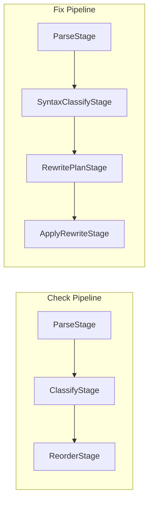
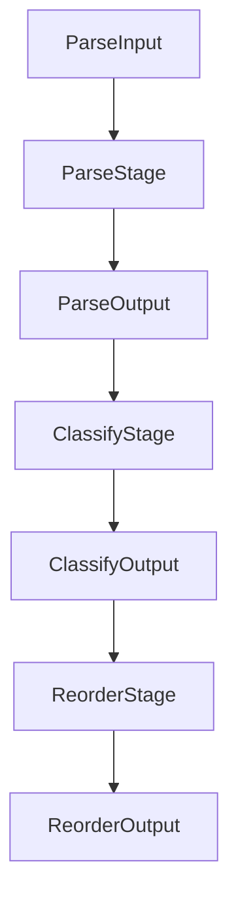

# Pipeline Module

Core pipeline architecture for composable data processing stages.

## Source Structure

```text
Sources/SwiftStructure/Pipeline/
├── Pipeline.swift
├── PipelineCoordinator.swift
└── Stages/
    ├── Protocols/
    │   └── Stage.swift
    ├── Parse/
    │   ├── ParseInput.swift
    │   ├── ParseOutput.swift
    │   └── ParseStage.swift
    ├── Classify/
    │   ├── ClassifyOutput.swift
    │   ├── ClassifyStage.swift
    │   ├── SyntaxClassifyOutput.swift
    │   └── SyntaxClassifyStage.swift
    ├── Reorder/
    │   ├── ReorderOutput.swift
    │   ├── ReorderReportStage.swift
    │   ├── ReorderStage.swift
    │   └── TypeReorderResult.swift
    ├── Report/
    │   └── ReportOutput.swift
    └── Rewrite/
        ├── ApplyRewriteStage.swift
        ├── IndexedSyntaxMember.swift
        ├── MemberReorderingRewriter.swift
        ├── RewriteOutput.swift
        ├── RewritePlanOutput.swift
        ├── RewritePlanStage.swift
        ├── TypeLocation.swift
        └── TypeRewritePlan.swift
```

## Documents

| Document | Description |
|----------|-------------|
| [Pipeline](Pipeline.md) | Generic stage compositor |
| [PipelineCoordinator](PipelineCoordinator.md) | Async file processing coordinator |

## Stages

| Module | Description |
|--------|-------------|
| [Protocols](Stages/Protocols/README.md) | Stage protocol definition |
| [Parse](Stages/Parse/README.md) | Source code parsing |
| [Classify](Stages/Classify/README.md) | Type and member classification |
| [Reorder](Stages/Reorder/README.md) | Member reordering logic |
| [Report](Stages/Report/README.md) | Report generation |
| [Rewrite](Stages/Rewrite/README.md) | Syntax tree rewriting |

## Pipeline Architecture



## Stage Composition

Stages are composed using the `.then()` method:


## Data Flow



## Purpose

The Pipeline module:
- Defines the `Stage` protocol for composable processing
- Provides `Pipeline` type for stage composition
- Coordinates async file processing via `PipelineCoordinator`
- Implements concrete stages for each processing phase
