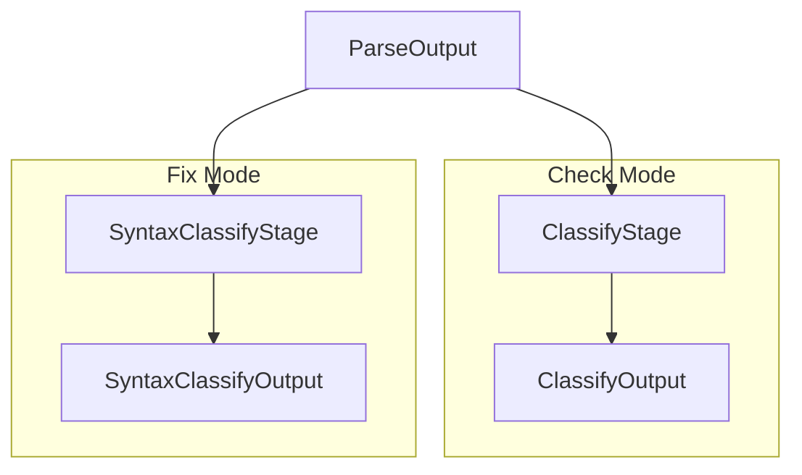

# Classify Module

Type and member classification stages.

## Source Structure

```text
Sources/SwiftStructure/Pipeline/Stages/Classify/
├── ClassifyOutput.swift
├── ClassifyStage.swift
├── SyntaxClassifyOutput.swift
└── SyntaxClassifyStage.swift
```

## Documents

| Document | Description |
|----------|-------------|
| [ClassifyOutput](ClassifyOutput.md) | Output with type declarations |
| [ClassifyStage](ClassifyStage.md) | Stage for check pipeline |
| [SyntaxClassifyOutput](SyntaxClassifyOutput.md) | Output with syntax references |
| [SyntaxClassifyStage](SyntaxClassifyStage.md) | Stage for fix pipeline |

## Two Classification Modes



| Mode | Stage | Output | Use Case |
|------|-------|--------|----------|
| Check | `ClassifyStage` | `ClassifyOutput` | Analysis only |
| Fix | `SyntaxClassifyStage` | `SyntaxClassifyOutput` | Rewriting |

## Purpose

The Classify module:
- Discovers type declarations in syntax tree
- Extracts member information for reordering analysis
- Preserves syntax references when rewriting is needed
