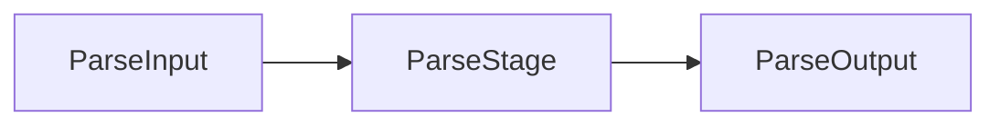

# Parse Module

Source code parsing stage using SwiftSyntax.

## Source Structure

```text
Sources/SwiftStructure/Pipeline/Stages/Parse/
├── ParseInput.swift
├── ParseOutput.swift
└── ParseStage.swift
```

## Documents

| Document | Description |
|----------|-------------|
| [ParseInput](ParseInput.md) | Input containing path and source |
| [ParseOutput](ParseOutput.md) | Output containing syntax tree |
| [ParseStage](ParseStage.md) | Stage that parses source code |

## Data Flow



## Purpose

The Parse module:
- Accepts file path and source code as input
- Parses source using SwiftSyntax Parser
- Produces syntax tree and location converter for downstream stages
