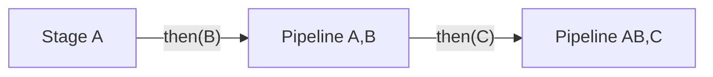

# Stage

**Source**: `Sources/SwiftStructure/Pipeline/Stages/Protocols/Stage.swift`

Core protocol for composable pipeline stages.

## Structure

| Component | Description |
|-----------|-------------|
| **Type** | `protocol Stage<Input, Output>` |
| **Inherits** | `Sendable` |

## Associated Types

| Type | Constraint | Description |
|------|------------|-------------|
| `Input` | `Sendable` | Stage input type |
| `Output` | `Sendable` | Stage output type |

## Required Methods

| Method | Parameters | Returns | Description |
|--------|------------|---------|-------------|
| `process(_:)` | `Input` | `Output` | Transform input to output |

## Extension Methods

| Method | Parameters | Returns | Description |
|--------|------------|---------|-------------|
| `then(_:)` | `Next: Stage` | `Pipeline<Self, Next>` | Chain with another stage |

## Composition

The `then()` method enables fluent stage composition:

## Type Constraints

- `then()` requires `Output == Next.Input`
- Both `Input` and `Output` must be `Sendable`
- Protocol itself requires `Sendable` conformance

## Design Decisions

- **Primary associated types**: `Stage<Input, Output>` enables type inference
- **Sendable requirement**: Enables concurrent stage execution
- **Single method**: Minimal interface following ISP
- **Extension-based chaining**: `then()` provided automatically

## Related

- [Pipeline](../../Pipeline.md) - Compositor returned by `then()`
