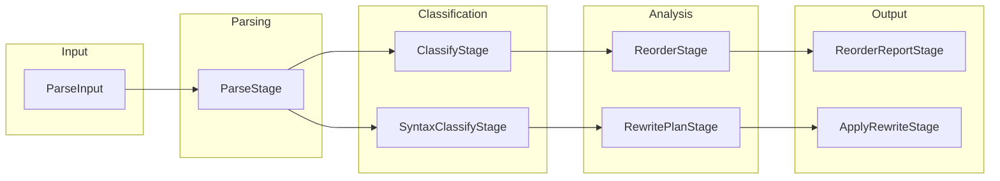

# Stages Module

Concrete pipeline stages for source code processing.

## Source Structure

```text
Sources/SwiftStructure/Pipeline/Stages/
├── Protocols/
│   └── Stage.swift
├── Parse/
│   ├── ParseInput.swift
│   ├── ParseOutput.swift
│   └── ParseStage.swift
├── Classify/
│   ├── ClassifyOutput.swift
│   ├── ClassifyStage.swift
│   ├── SyntaxClassifyOutput.swift
│   └── SyntaxClassifyStage.swift
├── Reorder/
│   ├── ReorderOutput.swift
│   ├── ReorderReportStage.swift
│   ├── ReorderStage.swift
│   └── TypeReorderResult.swift
├── Report/
│   └── ReportOutput.swift
└── Rewrite/
    ├── ApplyRewriteStage.swift
    ├── IndexedSyntaxMember.swift
    ├── MemberReorderingRewriter.swift
    ├── RewriteOutput.swift
    ├── RewritePlanOutput.swift
    ├── RewritePlanStage.swift
    ├── TypeLocation.swift
    └── TypeRewritePlan.swift
```

## Modules

| Module | Description |
|--------|-------------|
| [Protocols](Protocols/README.md) | Stage protocol definition |
| [Parse](Parse/README.md) | Source code parsing |
| [Classify](Classify/README.md) | Type and member classification |
| [Reorder](Reorder/README.md) | Member reordering analysis |
| [Report](Report/README.md) | Report generation |
| [Rewrite](Rewrite/README.md) | Syntax tree rewriting |

## Stage Flow



## Purpose

Each stage module contains:
- Input/Output types for data transfer
- Stage implementation conforming to `Stage` protocol
- Supporting types for stage-specific logic
