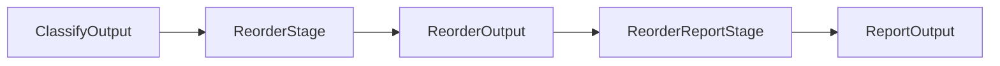

# Reorder Module

Member reordering analysis stages.

## Source Structure

```text
Sources/SwiftStructure/Pipeline/Stages/Reorder/
├── ReorderOutput.swift
├── ReorderReportStage.swift
├── ReorderStage.swift
└── TypeReorderResult.swift
```

## Documents

| Document | Description |
|----------|-------------|
| [ReorderOutput](ReorderOutput.md) | Output with reorder results |
| [ReorderReportStage](ReorderReportStage.md) | Report generation stage |
| [ReorderStage](ReorderStage.md) | Reorder analysis stage |
| [TypeReorderResult](TypeReorderResult.md) | Per-type reorder result |

## Data Flow



## Purpose

The Reorder module:
- Analyzes member ordering against configuration
- Determines which types need reordering
- Generates human-readable reports
