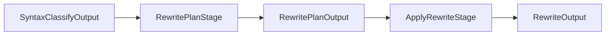

# Rewrite Module

Syntax tree rewriting stages for member reordering.

## Source Structure

```text
Sources/SwiftStructure/Pipeline/Stages/Rewrite/
├── ApplyRewriteStage.swift
├── IndexedSyntaxMember.swift
├── MemberReorderingRewriter.swift
├── RewriteOutput.swift
├── RewritePlanOutput.swift
├── RewritePlanStage.swift
├── TypeLocation.swift
└── TypeRewritePlan.swift
```

## Documents

| Document | Description |
|----------|-------------|
| [ApplyRewriteStage](ApplyRewriteStage.md) | Stage that applies rewrite plans |
| [IndexedSyntaxMember](IndexedSyntaxMember.md) | Member with original index |
| [MemberReorderingRewriter](MemberReorderingRewriter.md) | Syntax rewriter |
| [RewriteOutput](RewriteOutput.md) | Final rewritten output |
| [RewritePlanOutput](RewritePlanOutput.md) | Stage output with plans |
| [RewritePlanStage](RewritePlanStage.md) | Stage that creates plans |
| [TypeLocation](TypeLocation.md) | Type identifier key |
| [TypeRewritePlan](TypeRewritePlan.md) | Per-type rewrite plan |

## Data Flow



## Purpose

The Rewrite module:
- Creates rewrite plans from reorder analysis
- Applies plans using SwiftSyntax rewriter
- Preserves trivia (comments, whitespace)
- Produces rewritten source code
