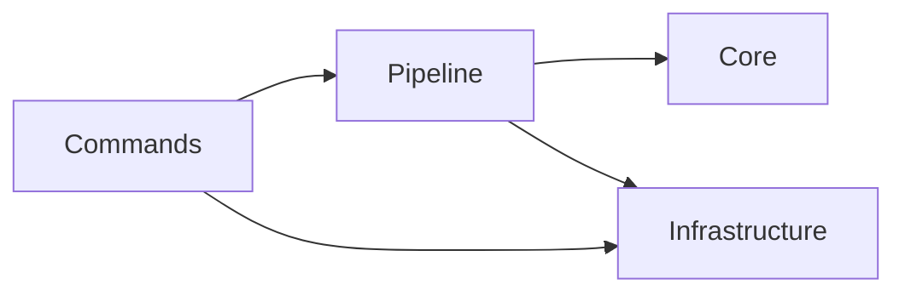
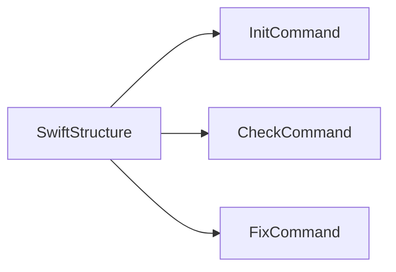
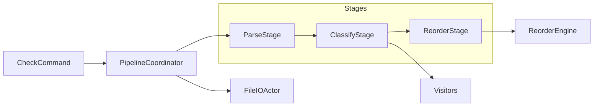
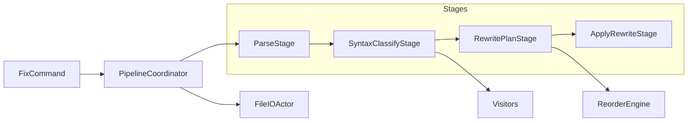

# CLI Documentation

Documentation for the SwiftStructure command-line interface with Swift 6 strict concurrency support.

## Source Structure

```text
Sources/SwiftStructure/
├── SwiftStructure.swift       # Entry point (@main)
├── Commands/                  # CLI commands with async/await
├── Core/                      # Domain models and logic
├── Infrastructure/            # Async file I/O abstractions
└── Pipeline/                  # Processing pipeline
```

## Documentation Modules

| Module | Description |
|--------|-------------|
| [SwiftStructure](SwiftStructure.md) | CLI entry point (`@main`) |
| [Commands](Commands/README.md) | CLI commands with Swift 6 concurrency |
| [Core](Core/README.md) | Configuration, models, visitors |
| [Infrastructure](Infrastructure/README.md) | Async file reading and writing |
| [Pipeline](Pipeline/README.md) | Stage-based processing |

## Quick Links

| Audience | Document |
|----------|----------|
| **Users** | [Commands/Usage.md](Commands/Usage.md) |
| **Developers** | Module READMEs above |

## Swift 6 Conformance

This CLI is fully compliant with Swift 6 strict concurrency:

- ✅ **Async/await**: Modern concurrency throughout
- ✅ **Actor isolation**: Thread-safe file operations
- ✅ **Sendable**: Safe data sharing across boundaries
- ✅ **Strict mode**: No @unchecked Sendable where avoidable

## Architecture Overview

### Layer Dependencies



### Command Structure



### Check Pipeline



### Fix Pipeline


