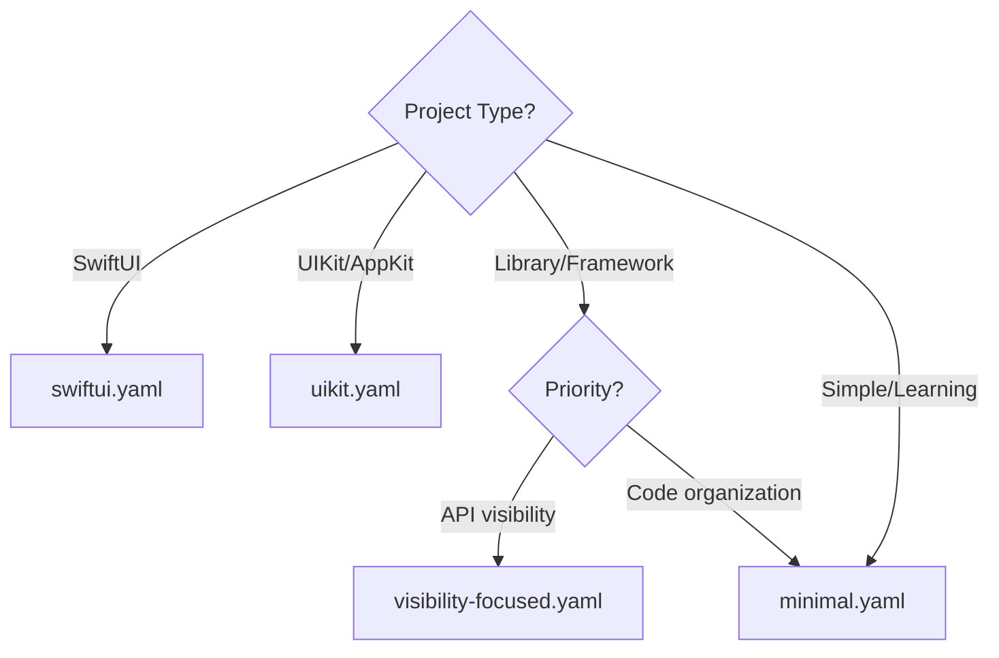

# Configuration Examples

Example configurations for different project types and use cases.

## Configuration Files

| File | Description |
|------|-------------|
| [minimal.yaml](minimal.yaml) | Simplest configuration with basic ordering |
| [swiftui.yaml](swiftui.yaml) | Optimized for SwiftUI with property wrappers |
| [uikit.yaml](uikit.yaml) | Optimized for UIKit with lifecycle awareness |
| [visibility-focused.yaml](visibility-focused.yaml) | Ordering primarily by access level |

## Integration Guides

| Guide | Description |
|-------|-------------|
| [Xcode Integration](xcode-integration.md) | Build phases, scripts, and editor extensions |
| [CI Integration](ci-integration.md) | GitHub Actions, GitLab CI, Bitrise |

## Quick Start

1. Copy the example that matches your project type
2. Rename to `.swift-structure.yaml`
3. Place in your project root
4. Run `swift-structure check` to verify

```bash
# Copy example
cp Docs/Examples/swiftui.yaml .swift-structure.yaml

# Check your files
swift-structure check Sources/**/*.swift
```

## Choosing an Example


